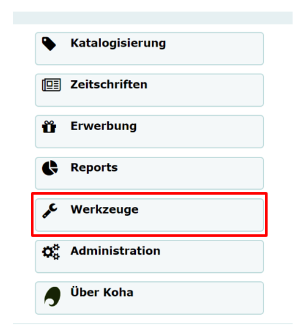

## Import der Benutzerdaten
Falls Sie schon vor dem Umstieg auf das Bibliothekssystem "Koha" Ihre Benutzerdaten gesondert vorliegen haben, so ist es möglich diese in das System zu importieren. Hierfür sollten die Daten allerdings als **CSV-Datei** vorliegen. Ist dies bei Ihrer Bibliothek nicht der Fall, so können die diesen Unterpunkt überspringen und direkt zum nächsten gehen. 

Zunächst öffnen Sie von der Koha-Startseite aus die Kategorie "Werkzeuge".

Nun wählen Sie den Unterpunkt "Benutzer importieren" aus.

Es öffnet sich nun eine Seite, auf der Sie sämtliche Einstellungen bezüglich Ihrer Datei auswählen können. 

Zuerst wählen Sie die Datei aus, die Ihre Benutzerdaten enthält. 
Damit die ausgewählte CSV-Datei optimal verarbeitet werden kann, sollte sie in einem bestimmten Format vorliegen. Die erste Zeile der Datei muss eine Kopfzeile sein, die die verschiedenen Spalten benennt. Außerdem gibt es eine Vorgabe, was die Benennung der Spalten betrifft. Um diese Vorgabe zu erfüllen, können Sie sich auf der rechten Seite eine leere CSV-Datei herunterladen, die die unterschiedlichen Spalten enthält. Diese können Sie mit Ihren individuellen Werten ausfüllen. Die Werte innerhalb der Datei werden durch Kommata voneinander getrennt. Wenn ein Feld der CSV-Datei mehr als einen Wert enthält, so sollte jeder Wert einzeln in Anführungszeichen gesetzt und durch Komma getrennt werden. Jede Datei sollte die **Pflichtfelder** "surname", "branchcode" und "categoriecode" enthalten. Die Passwörter der Benutzer werden im Klartext gespeichert und nachträglich verschlüsselt. 
Treffen diese Vorgaben bezüglich der CSV-Datei zu, so können Sie diese für den Import der Daten auswählen. Es gibt die Möglichkeit  eine Benutzerliste anlegen zu lassen, dies ist notwendig, wenn Sie ihre Daten gruppieren wollen. Anschließend muss ein Feld ausgewählt werden, das für den Abgleich der Datensätze genutzt wird. Dafür eignet sich in den meisten Fällen die Ausweisnummer der Benutzer. 
Als nächsten Schritt können bei Bedarf verschiedene voreingestellte Werte festgelegt werden. Es öffnet sich eine Maske mit jeglichen Kategorien der Datei. 

Wenn Sie in ein Feld einen bestimmten Wert eintragen, so wird dieser Wert in allen Datensätzen ersetzt. 

Als nächstes gibt es noch zwei Einstellungsoptionen, was das Überschreiben der bisherigen Daten betrifft. 

Falls Sie beispielsweise während des Wechsels auf das neue Bibliothekssystem bereits Benutzerdatensätze erstellt haben und diese sich nun mit den Daten der CSV-Datei doppeln, so ist es möglich, die vorhandenen Datensätze mit den jetzigen zu überschreiben oder die Datensätze im System bestehen zu lassen. 
Eine ähnliche Option besteht geneüber den Benutzerattributen, welche alle überschrieben werden können oder nur die, die in der CSV-Datei enthalten sind. 
Auf der Abbildung sehen Sie welche Werte standardmäßig eingestellt sind. Es wird empfohlen diese weitestgehend zu übernehmen. Mit dem Bestätigen des Import-Buttons wird Ihre Auswahl übernommen. 
