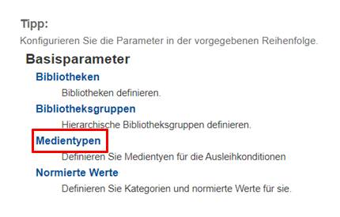
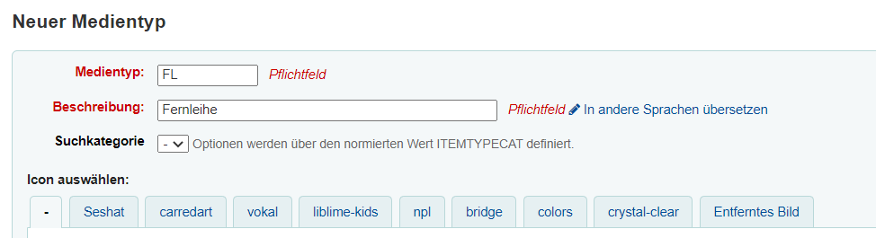
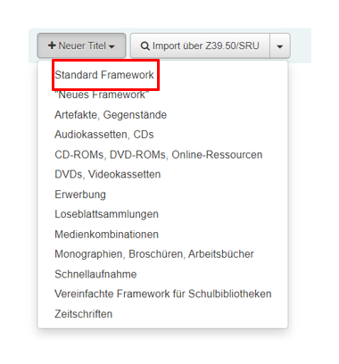
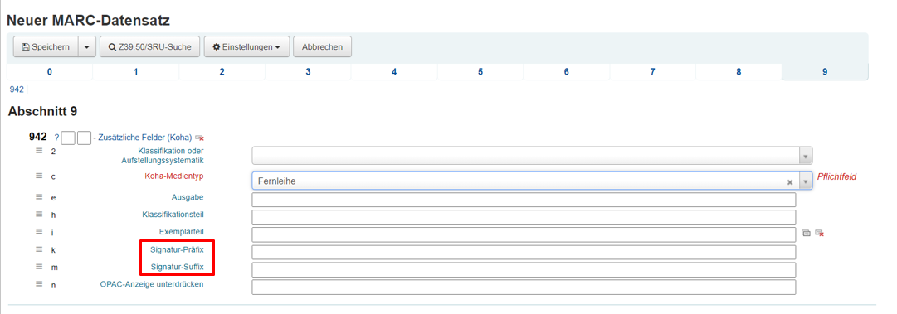

# Fernleihe

Oftmals tritt der Fall ein, dass Benutzende der Bibliothek ein bestimmtes Medium ausleihen möchten, welches nicht im Bestand der Bibliothek vorhand ist. Allerding kann die Bibliothek nun auf die sogenannte **Fernleihe** zurückgreifen. Dabei bestellt die Bibliothek die gewünschte Ressource bei einer Bibliothek, die diese im Bestand hat und es erfolgt schon bald eine Lieferung dieser. In der Regel findet diese Leihverkehr innerhalb eines Bibliotheksverbundes statt. [Hier](https://bibliotheksportal.de/informationen/bibliothekslandschaft/bibliotheksverbuende/) können Sie sich über die verschiedenen Verbundssysteme in Deutschland informieren. Da die Bestellung der Medien meist über das Online-Portal des jeweiligen Verbundes läuft, wird in dieser Dokumentation nur auf die Handhabung der bestellten Medien, wenn die Bestellung bereits eingrtroffen ist eingegangen.  

## Konfiguration

Ist die bestellte Fernleihe in Ihrer Bibliothek eingetroffen, so sollte das Medium mithilfe eines verkürzten Datensatzes in das System aufgenommen werden. Zunächst muss hierfür der Medientyp "Fernleihe" konfiguriert werden. Von der Koha-Startseite aus wählen Sie das Feld "Administration" aus. Danach sollten Sie den Unterpunkt "Medientypen" betätigen. 

Nun befinden Sie sich auf einer Ansicht, welche die bereits vorhandenen Medientypen tabellarisch darstellt. Sie sollten als nächsten Schritt den Button "Neuer Medientyp" auswählen. 

In das vorgefertigte Formular tragen Sie den Code für den Medientyp ein, in diesem Fall "FL". Als zugehörige Beschreibung wird "Fernleihe" in die Zeile eingetragen. Anschließend bestätigen Sie die Konfiguration mit dem Button "Änderungen speichern". Nun sollte der Medientyp "Fernleihe" neben den anderen in der Tabelle erscheinen. 

## Katalogisierung

Als nächsten Schritt sollte die bestellte Fernleihe katalogisiert werden. Von der Startseite aus wählen Sie das Feld "Katalogisierung" aus. Nun wählen Sie den Button "Neuer Titel" aus. Nachfolgend wird ein Dropdown-Menü ausgeklappt, bei dem Sie das "Standard Framework" wählen sollten. 

Bei der Katalogisierung von Fernleihen sind nur die nötigsten Bestandteile zu erfassen. Diese Informationen befinden sich normalerweise auf dem Leihschein, welcher der Fernleihe mitgeliefert wird. 
Da die wesentlichen Bestandteile der Katalogisierung unverändert bleiben, wird in diesem Teil der Dokumentation nicht näher darauf eingegangen. Sollten allerdings Fragen bei Ihnen aufkommen, so können sie bei der [Katalogisierung](Oeb/katalogisierung/) diese nachschlagen. 
Haben Sie alle wichtigen Bestandteile des Mediums eingetragen, so wechseln Sie den oberen reiter auf die Zahl "9".

In diesem Abschnitt ist es möglich, den zuvor eingestellten Medientyp auf "Fernleihe" zu stellen. Des Weiteren sollte der Signatur-Präfix aus der Abkürzung "Fl" für Fernleihe bestehen. Im Feld zum Suffix der Signatur tragen Sie die Signatur ein, die sich auf dem bestellten Medium befindet. Nun speichern Sie den entstandenen Datensatz mithilfe des Buttons "Speichern" ab. Anschließend sollte es Ihnen möglich sein im Bibliothekssystem nach der Fernleihe zu suchen und diese dem entsprechenden Nutzenden auszuleihen. 
