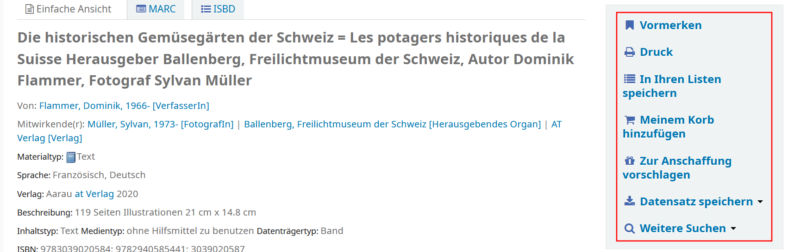
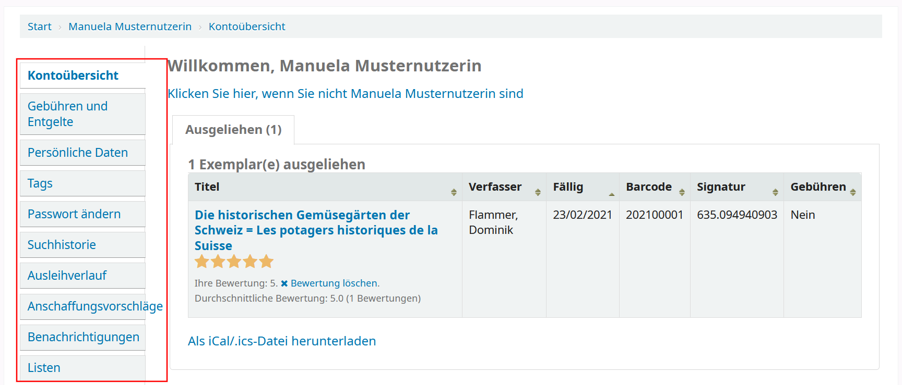
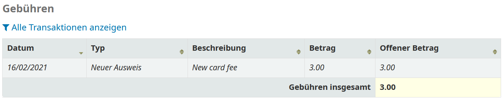
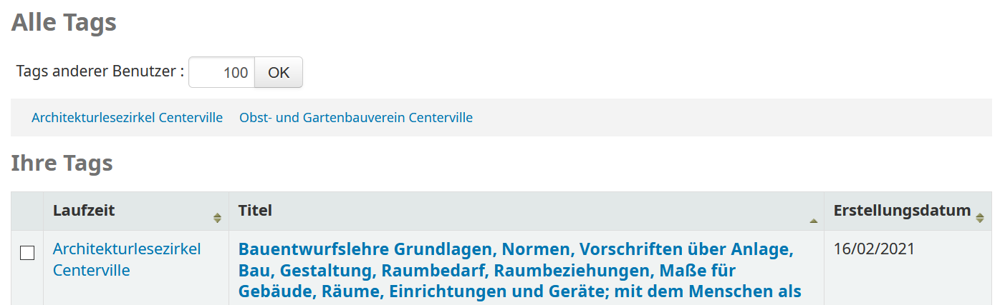
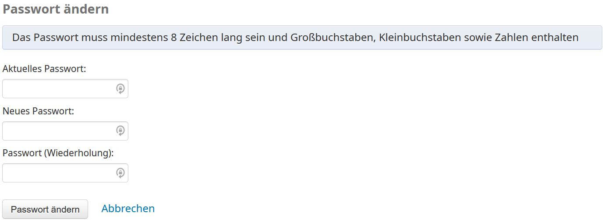
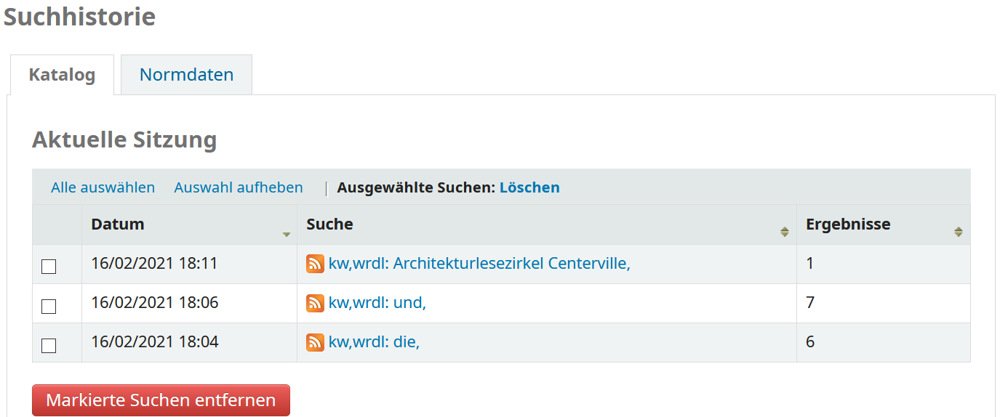
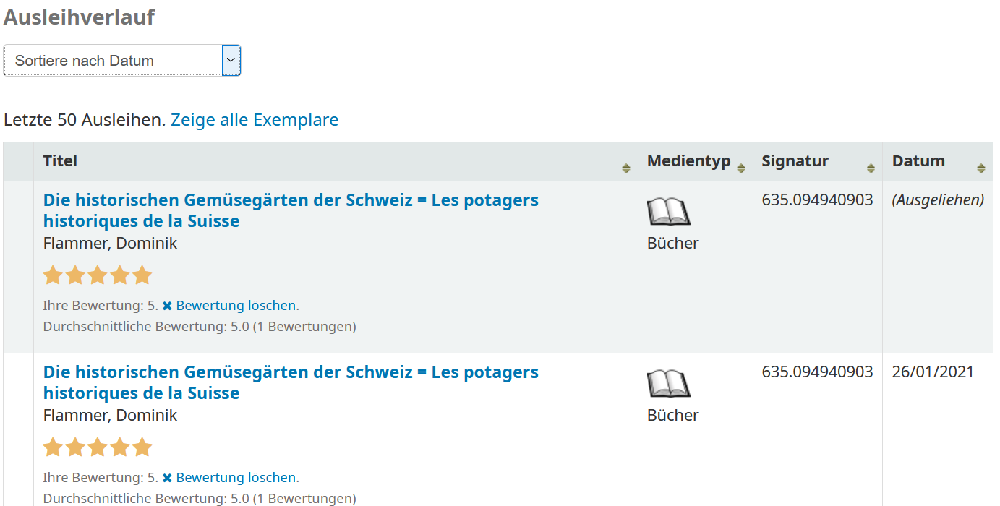
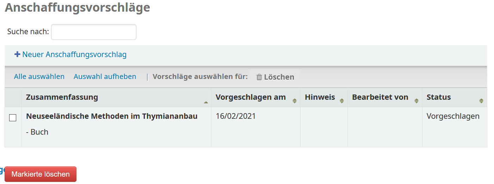
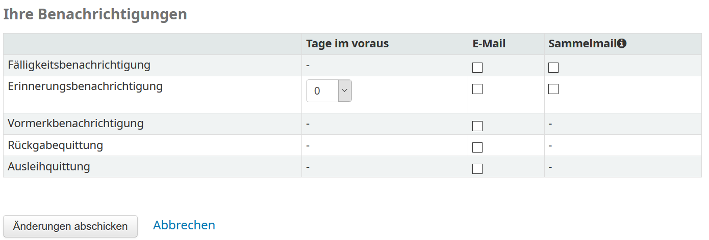
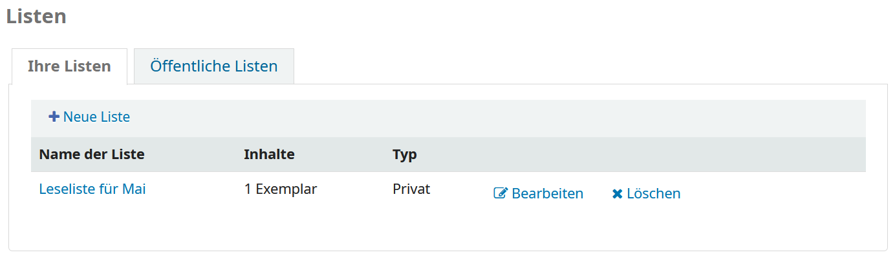

Der **Online Public Access Catalog (OPAC)** ist die Oberfläche der Bibliothek aus Perspektive der Nutzenden und kann zwar über die Verwaltungsoberfläche konfiguriert werden, existiert aber als Webseite unabhängig von dieser. Es handelt sich um eine Web-Oberfläche, welche in erster Linie den Nutzenden einer Bibliothek dazu dient, außerhalb der Bibliothek auf eigenen Geräten den Bestand zu durchsuchen. Darüber hinaus bietet der OPAC den Nutzenden viele Funktionen, für welche diese ansonsten die Bibliothek in Person besuchen und ihre Anliegen den Verantwortlichen mitteilen müssten.
Diese Seite behandelt die Möglichkeiten, die Nutzende durch einen OPAC haben. Um mehr zur Konfiguration des OPACs zu erfahren, lesen Sie die Seite [OPAC](Oeb/opac.md).

# Suche

Gut sichtbar im Header finden Nutzende einen Suchschlitz mit ausklappbarer Suchparameterauswahl daneben. In der Suchparameterauswahl können Nutzende konkretisieren, welche Felder im Katalog mit der Eingabe durchsucht werden. Sollen mehrere Felder gleichzeitig durchsucht werden, bietet sich die erweiterte Suche an, welche unter dem Suchschlitz aufgerufen werden kann.

# Titelansicht

Die Titelansicht gibt alle Informationen zu einem Titel an, Informationen zu den jeweiligen Exemplaren und deren Verfügbarkeit findet man hier jeweils unten in Form einer Liste. Die Menge an Informationen zum Titel sind abhängig davon, was in der koha-Verwaltungsoberfläche konfiguriert wurde und welche Informationen im Titeldatensatz hinterlegt sind. Rechts gibt es einen Bereich mit unterschiedlichen Aktionen, welche im Nachfolgenden erläutert werden.

## Vormerken

Diese Aktion erlaubt es den Nutzenden, ein bestimmtes oder ein unbestimmtes Exemplar dieses Titels vorzumerken, wenn zurzeit kein Exemplar zur Ausleihe verfügbar ist. Nachdem „Vormerken“ angeklickt wird, muss auf der nächsten Seite die Vormerkung auf die angemeldete Person bestätigt werden. Mehr zum Thema Vormerkungen finden Sie auf der Seite [Ausleihe](Oeb/ausleihe.md).

## Druck

Dieses Feld öffnet die Druckerauswahl Ihres jeweiligen Geräts. Dadurch kann eine Art „Notizzettel“ ausgedruckt werden, welche den Standort und die Signatur der Exemplare enthält und somit das Finden des Titels innerhalb der Bibliothek erleichtert.

## In Ihren Listen speichern

Dieses Feld erlaubt es Nutzenden, Titel zu einer Liste hinzuzufügen und sich diese Titel somit für sich selbst zu merken, wenn sie nicht unbedingt direkt eine Vormerkung starten wollen.

## Meinem Korb hinzufügen

Der Korb ist eine weitere Funktion, welche nur von den Nutzenden für sich selbst in Anspruch genommen werden kann. Auch er stellt eine Art „Merkliste“ dar, allerdings optimiert für Titel, die man in der nahen Zukunft auszuleihen plant. In einem Korb kann man die Titel, die man in der Bibliothek ausleihen will, abspeichern und sich dann als Liste exportieren, ausdrucken oder auch per Mail an sich selbst schicken.

## Zur Anschaffung vorschlagen

Dieses Feld übernimmt die angezeigten Titeldaten und formuliert auf der nächsten Seite daraus einen Anschaffungsvorschlag. Dies macht Sinn, wenn an den Titeldatensatz keine Exemplare angehängt sind, welche man ausleihen oder vormerken könnte.

## Datensatz speichern

Hier kann der Titeldatensatz in unterschiedliche Metadatenschemata exportiert werden, was beispielsweise den Import in eigene Literaturverwaltungsprogramme ermöglicht. Exportiert werden kann in die Formate BIBTEX, Dublin Core, MARC (mit drei verschiedenen Zeichencodierungen), MODS, RIS und ISBD.

## Weitere Suchen

Hier werden den Nutzenden weitere Suchmöglichkeiten hinterlegt, an welche der Titel weitergegeben werden kann. Standardmäßig werden hier WorldCat, Google Scholar und bookfinder.com gelistet.

# Benutzerkonto

## Kontoübersicht

Die erste Seite passt sich vollkommen an das eigene Konto an und kann unter Umständen auch leer sein. Ansonsten gibt es hier eine Reiternavigation, welche Ausleihen, Vormerkungen und Anschaffungsvorschläge umfassen kann, wenn es jeweils welche gibt.

## Gebühren und Entgelte

Sofern für das Konto Gebühren verzeichnet sind, werden diese hier aufgezählt. Werden diese Gebühren in der Bibliothek bezahlt und in der Verwaltung als bezahlt bestätigt, so tauchen diese nicht mehr in dieser Übersicht auf, können allerdings unter „Alle Transaktionen anzeigen“ erneut eingesehen werden.

## Persönliche Daten

Hier können Nutzende die persönlichen Daten wie Name, Adresse, E-Mail-Adresse und Telefonnummer selbst aktualisieren. Daten im System, die Nutzende nicht bearbeiten können, wie etwa die Ausweisnummer, können hier eingesehen werden.

## Tags

Tags sind eine Art „Schlagwörter“, welche Nutzende frei den Titeln im Katalog anhängen können. Innerhalb des Katalogs sind diese Tags zwar allen sichtbar, aber Tags können schnell durch die Verwaltung wieder gelöscht werden. In diesem Menü können alle selbst erstellten Tags eingesehen und bei Bedarf selbst gelöscht werden.

## Passwort ändern

Dieses Menü dient Nutzenden lediglich dazu, ihr Passwort für den OPAC-Zugang eigenständig zu ändern. Zur Bestätigung muss das alte Passwort als erstes eingegeben werden.

## Suchhistorie

Hier wird Nutzenden ermöglicht, ihre vergangenen Suchen in koha noch einmal anzuschauen und gegebenenfalls erneut zu tätigen. Die Suchhistorie kann hier auch jederzeit gelöscht werden.

## Ausleihverlauf

Hier können sich Nutzende je nach Konfiguration in der Verwaltung ihre aktuellen und vergangenen Ausleihen anschauen, etwa um vormals ausgeliehene Bücher schneller wiederzufinden.

## Anschaffungsvorschläge

Eine Übersicht der an die Bibliothek gesendeten Anschaffungsvorschläge findet sich hier, daneben steht der Status der Bearbeitung und die für die Bearbeitung des Anschaffungsvorschlags verantwortliche Person in der Verwaltung. Oben im Menü können neue Anschaffungsvorschläge erstellt werden, die vorhandenen Informationen zum gewünschten Titel werden in eine Maske auf einer eigenen Seite eingetragen und abgeschickt.

## Benachrichtigungen

In diesem Menü können Nutzende die Parameter für an sie gesendete Benachrichtigungen konfigurieren, etwa ob Aktionen nur im OPAC eine Benachrichtigung auslösen, oder ob diese auch eine Mail an das jeweils eingetragene Konto verschicken.

## Listen

Hier werden alle Listen aufgezählt, die von diesem Konto erstellt wurden. Sie werden in private und öffentliche Listen in einer Reiternavigation getrennt dargestellt. Nutzende können die enthaltenen Titel einsehen und die Listen löschen oder bearbeiten, oder aber jeweils oben in der Übersicht eine ganz neue Liste erstellen.
