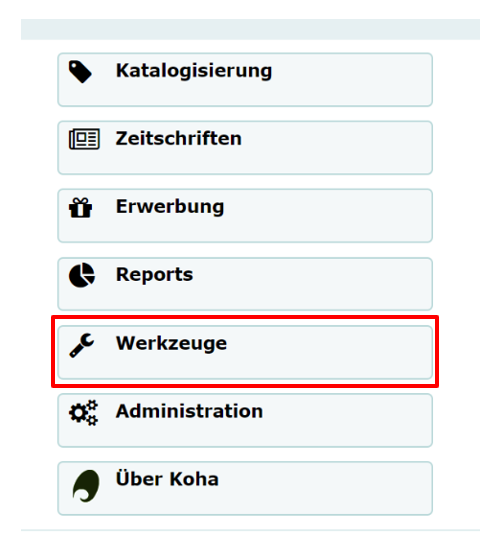
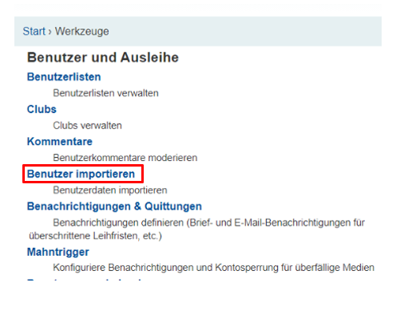
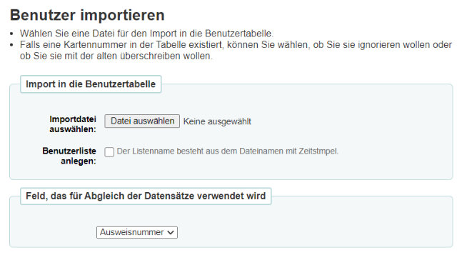
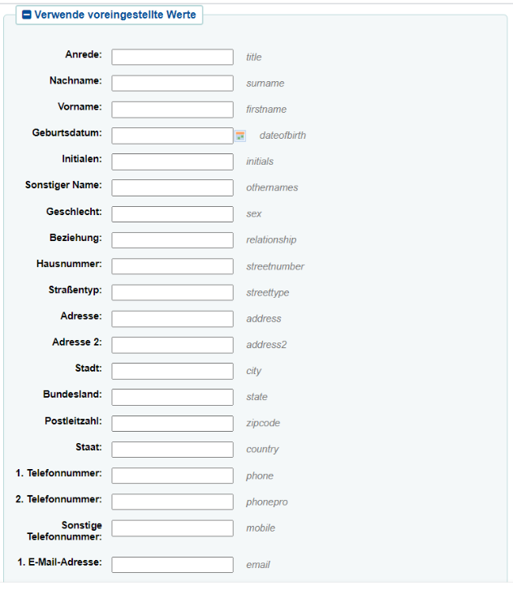
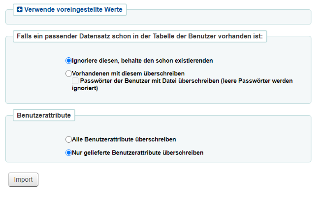
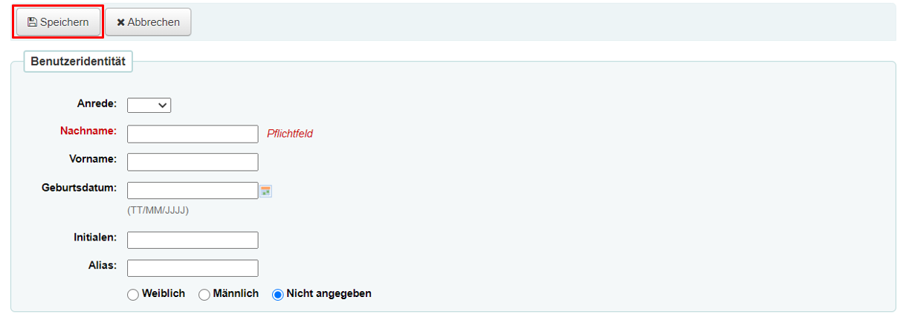
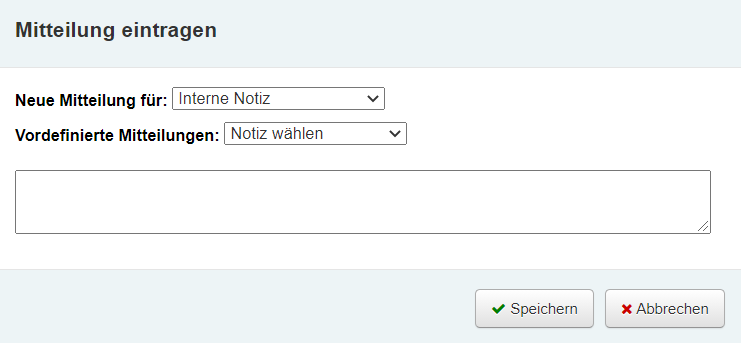

# Benutzerverwaltung
Jeder Benutzende einer Bibliothek mit einem Bibliotheksausweis, wird in einem Bibliothekssystem in einer Datenbank hinterlegt. Koha bietet vielseitige Möglichkeiten diese Datensätze anzulegen, zu bearbeiten und verschiedene Einstellungen zu treffen. 

## Import der Benutzerdaten
Falls Sie schon vor dem Umstieg auf das Bibliothekssystem "Koha" Ihre Benutzerdaten gesondert vorliegen haben, so ist es möglich diese in das System zu importieren. Hierfür sollten die Daten allerdings als **CSV-Datei** vorliegen. Ist dies bei Ihrer Bibliothek nicht der Fall, so können die diesen Unterpunkt überspringen und direkt zum nächsten gehen. 

Zunächst öffnen Sie von der Koha-Startseite aus die Kategorie "Werkzeuge".

Nun wählen Sie den Unterpunkt "Benutzer importieren" aus.

Es öffnet sich nun eine Seite, auf der Sie sämtliche Einstellungen bezüglich Ihrer Datei auswählen können. 

Zuerst wählen Sie die Datei aus, die Ihre Benutzerdaten enthält. 
Damit die ausgewählte CSV-Datei optimal verarbeitet werden kann, sollte sie in einem bestimmten Format vorliegen. Die erste Zeile der Datei muss eine Kopfzeile sein, die die verschiedenen Spalten benennt. Außerdem gibt es eine Vorgabe, was die Benennung der Spalten betrifft. Um diese Vorgabe zu erfüllen, können Sie sich auf der rechten Seite eine leere CSV-Datei herunterladen, die die unterschiedlichen Spalten enthält. Diese können Sie mit Ihren individuellen Werten ausfüllen. Die Werte innerhalb der Datei werden durch Kommata voneinander getrennt. Wenn ein Feld der CSV-Datei mehr als einen Wert enthält, so sollte jeder Wert einzeln in Anführungszeichen gesetzt und durch Komma getrennt werden. Jede Datei sollte die **Pflichtfelder** "surname", "branchcode" und "categoriecode" enthalten. Die Passwörter der Benutzer werden im Klartext gespeichert und nachträglich verschlüsselt. 
Treffen diese Vorgaben bezüglich der CSV-Datei zu, so können Sie diese für den Import der Daten auswählen. Es gibt die Möglichkeit  eine Benutzerliste anlegen zu lassen, dies ist notwendig, wenn Sie ihre Daten gruppieren wollen. Anschließend muss ein Feld ausgewählt werden, das für den Abgleich der Datensätze genutzt wird. Dafür eignet sich in den meisten Fällen die Ausweisnummer der Benutzer. 
Als nächsten Schritt können bei Bedarf verschiedene voreingestellte Werte festgelegt werden. Es öffnet sich eine Maske mit jeglichen Kategorien der Datei. 

Wenn Sie in ein Feld einen bestimmten Wert eintragen, so wird dieser Wert in allen Datensätzen ersetzt. 

Als nächstes gibt es noch zwei Einstellungsoptionen, was das Überschreiben der bisherigen Daten betrifft. 

Falls Sie beispielsweise während des Wechsels auf das neue Bibliothekssystem bereits Benutzerdatensätze erstellt haben und diese sich nun mit den Daten der CSV-Datei doppeln, so ist es möglich, die vorhandenen Datensätze mit den jetzigen zu überschreiben oder die Datensätze im System bestehen zu lassen. 
Eine ähnliche Option besteht geneüber den Benutzerattributen, welche alle überschrieben werden können oder nur die, die in der CSV-Datei enthalten sind. 
Auf der Abbildung sehen Sie welche Werte standardmäßig eingestellt sind. Es wird empfohlen diese weitestgehend zu übernehmen. Mit dem Bestätigen des Import-Buttons wird Ihre Auswahl übernommen. 

## Benutzerneuerfassung
Auf der Startseite von Koha können Sie die Benutzerverwaltung, über die Schaltfläche "Benutzer" oder den Link "Benutzer suchen", öffnen.

Nun kann der Button" "Neuer Benutzer" ausgewählt werden und der Benutzertyp wird von Ihnen festgelegt. Es öffnet sich eine leere Datenmaske mit einigen Feldern.
Der Nachname und die Ausweisnummer sind immer Pflichtfelder, welche zwangsläufig ausgefüllt werden müssen. Andere Felder, wie die Adresse oder Angaben zur Person, können zusätzlich ausgefüllt werden. Wenn alle notwendigen Angaben erfasst wurden, kann das Formular über den Button "Speichern, der sich am Anfang der Datenmaske befindet, in der Datenbank gespeichert werden.

Im Anschluss wird der Benutzername automatisch von Koha angezeigt.

## Suchen von Benutzern
In der Suchleiste, welche sich ebenfalls auf der Benutzer-Oberfläche befindet, können die Benutzer:innen gesucht werden. Dies geschieht mithilfe der Ausweisnummer des Bibliotheksausweises oder dem Namen des Benutzers. Zusätzlich werden verschiedene Filteroptionen links unterhalb der Suchleiste oder über das Zeichen rechts neben der Suchleiste angezeigt.

## Bearbeiten von Benutzerdatensätzen
Um den Datensatz eines Benutzers zu bearbeiten, muss zuerst das dazugehörige Konto geöffnet werden. Dafür sollte das Ausleihfenster von Koha geöffnet sein. Geben Sie dafür den Namen oder die Ausweisnummer des Nutzers in die Suchleiste ein. Über den Button "Bearbeiten" öffnet sich die Änderungsmaske des Nutzerdatensatzes.

Nun können verschiedenen Änderungen der Einstellungen vorgenommen werden. 

**Verlängern des Bibliotheksausweises:** Im Feld "Kontodaten" kann das Ablaufdatum des Bibliotheksausweises verlängert werden.

**Sperren des Benutzerkontos:** In den Feldern "Sperren" und "Benutzersperren" können Nutzer gesperrt werden. Beispielsweise wenn sie Ihren Bibliotheksausweis verloren haben. Für das Sperren von Benutzern kann manuell ein Ablaufdatum der Sperre eingetragen werden. Zusätzlich kann vermerkt werden, aus welchem Grund das Konto temporär gesperrt ist.

**Zusammenführen von Benutzerdatensätzen:** Mit dem Button "Benutzer suchen" werden die Datensätze gesucht, die zusammengeführt werden sollen und mit der Checkbox markiert. Der Datensatz der übernommen werden soll wird mithilfe eines Radiobutton ausgewählt. Danach bestätigen Sie Ihre Auswahl mit dem Button "Benutzer verschmelzen".

## Benutzerkonto
**Eintragen einer Notiz:** Um eine Notiz in einem Benutzerkonto einzutragen, sollten Sie sich erneut auf dem Ausleihfenster von Koha befinden. Nun öffnen Sie das Konto des gewünschten Nutzers über die Suchleiste. Daraufhin wählen Sie den Button "Neue Mitteilung" aus. In der sich geöffneten Maske wählen Sie aus, ob die Benachrichtigung intern oder extern sein soll.

Außerdem fügen Sie in das Textfeld die Benachrichtigung für den Nutzer ein. Die Auswahl wird anschließend mit dem Button "Speichern" bestätigt. 

**Abrufen von Notizen:** Möchten Sie eine Übersicht über die bereits versendeten Benachrichtigungen eines Nutzers, so wählen Sie, nachdem das entsprechende Konto geöffnet wurde, den linken Reiter "Benachrichtigungen" aus. 

## Gebühren
**Erheben von Gebühren:** Um bei einem bestimmten Benutzer Gebühren zu erheben, muss zuerst das entsprechende Konto geöffnet werden. Danach könne Sie links den Reiter "Gebühren" auswählen. Nun betätigen Sie den Button "Gebühr erheben" und es erscheint ein Formular zum manuellen Erfassen von Gebühren.

Über den Typ bestimmen Sie die Art der Gebühr. Wenn ein Benutzender beispielsweise ein Medium der Bibliothek verloren hat, kann der Barcode des Mediums eingetragen werden. Durch Speichern des Formulars werden die Gebühren, sowie der zu bezahlende Gesamtbetrag angezeigt. Die Bibliotheksbenutzer können ihre offnene Gebühren im OPAC einsehen. 

**Erlassen/Bezahlen von Gebühren:** Wenn der Benutzende den anstehenden Gebühren beglichen hat, werden diese manuell vom Konto entfernt. Hierfür wird das entsprechene Konto geöffnet und erneut der Reiter "Gebühren" ausgewählt. Nun erscheint unter "Bezahlen" das Formular "Gebühren zahlen". 

Bei diesem kann ausgewählt werden, welche Gebühren bezahlt wurden. Wählen Sie den Button "Alle auswählen" aus, so erscheint der Gesamtbetrag aller Gebühren. Nun haben Sie die Wahl zwischen dem Button "Bezahlen" oder "Erlassen". 
Es gibt die Möglichkeit eine Quittung zu drucken, indem sie den Button "Drucken" betätigen. Daraufhin wird sich der Druckdialog Ihres Internetbrowsers öffnen, welchen Sie bestätigen können. 
