# Benutzerverwaltung
Jeder Benutzende einer Bibliothek mit einem Bibliotheksausweis wird in einem Bibliothekssystem in einer Datenbank hinterlegt. Koha bietet vielseitige Möglichkeiten, diese Datensätze anzulegen, zu bearbeiten und verschiedene Einstellungen zu treffen. 

## Benutzerneuerfassung
Auf der Startseite von Koha können Sie die Benutzerverwaltung über die Schaltfläche "Benutzer" oder den Link "Benutzer suchen", öffnen.

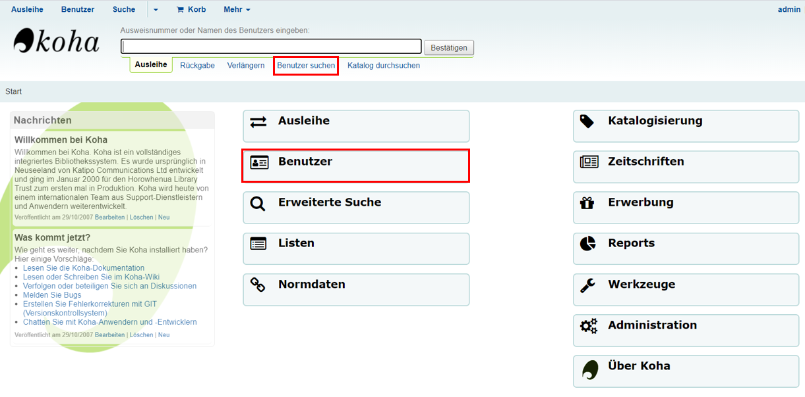

Nun kann der Button "Neuer Benutzer" ausgewählt werden und der Benutzertyp wird von Ihnen festgelegt.
 
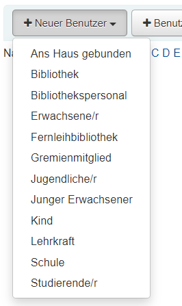

Es öffnet sich eine leere Datenmaske mit einigen Feldern.
Der Nachname und die Ausweisnummer sind immer Pflichtfelder, welche zwangsläufig ausgefüllt werden müssen. Diese sind immer mit roter Schrift gekennzeichnet. Andere Felder, wie die Adresse oder Angaben zur Person, können zusätzlich ausgefüllt werden. Wenn alle notwendigen Angaben erfasst wurden, kann das Formular über den Button "Speichern", der sich am Anfang der Datenmaske befindet, in der Datenbank gespeichert werden.

In diesem Fall wurde beispielhaft ein Benutzerdatensatz für einen Erwachsenen erstellt. In der Kategorie "Benutzeridentität" ist der Nachname verpflichtend einzutragen.

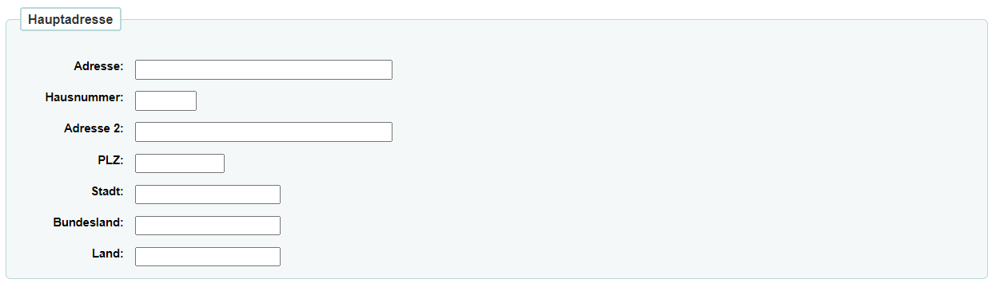

In der Kategorie "Hauptadresse" ist die Anschrift des Benutzers einzutragen. Dies ist notwendig, wenn Erinnerungen an die Leihfrist per Post verschickt werden sollen.

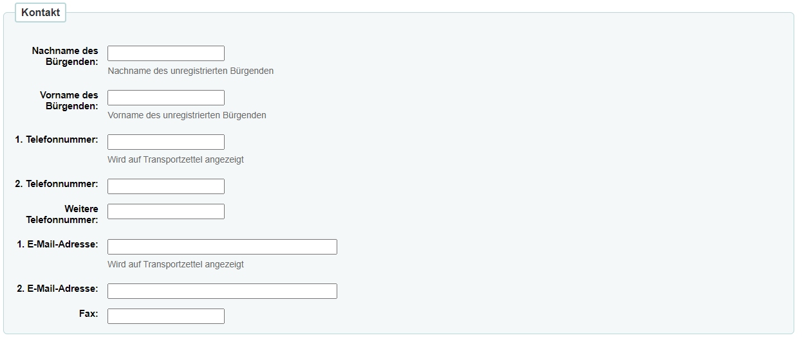

Bei der Kategorie "Kontakt" gibt es die Möglichkeit, einen Bürgenden für den Bibliotheksnutzenden einzutragen.

Es gibt zwei weitere Kategorien, in die ein alternativer Kontakt und eine alternative Adresse eingetragen werden können.

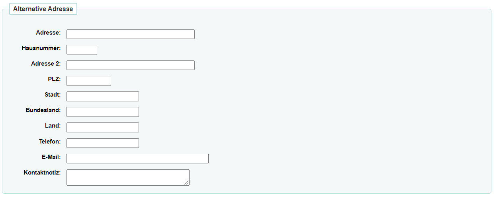

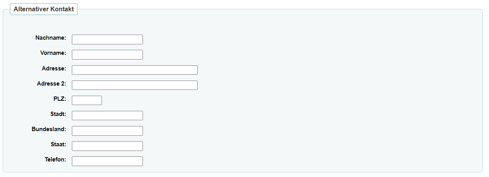

In der Kategorie "Bibliotheksverwaltung" ist die Ausweisnummer sowie die Bibliothek und der Benutzertyp verpflichtend zu erfassen. 

Auch für die Kontodaten jedes benutzers gibt es eine Kategorie, in diese wird automatisch das Datum des Anmeldetages als Anmeldedatum eingetragen. 

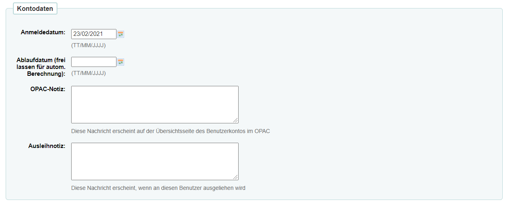

Die Kategorie "Opac-/Mitarbeitendenlogin" enthält das verschlüsselte Passwort zum Login des Benutzers im OPAC.

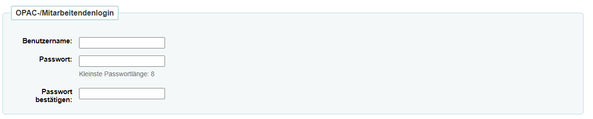

In der letzten Kategorie "Benachrichtigungseinstellungen" können Haken bei den gewünschten Benachrichtigungsarten gesetzt werden. 

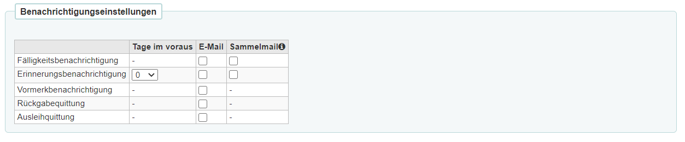

Sind die Formulare den Anforderungen entsprechend ausgefüllt, so kann dies gespeichert werden. 

## Konfiguration von Benutzertypen

Es besteht die Möglichkeit, dass bestimmte Benutzertypen nach Ihren Vorstellungen konfiguriert werden können. 
Hierfür sollten Sie auf der Koha-Startseite das Feld "Administration" auswählen. 

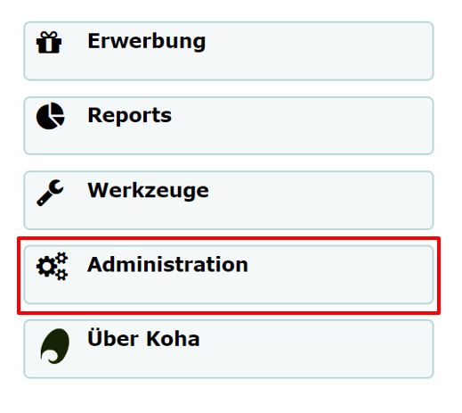

Anschließend wählen Sie die Option "Benutzertypen" aus.

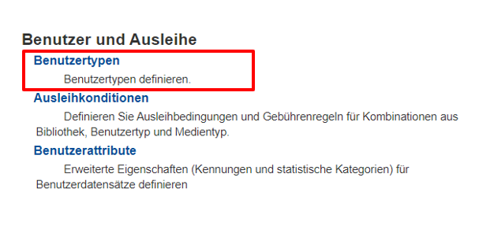

In diesem Beispiel würde der Benutzertyp "Schüler:in" erstellt. Verpflichtend zu erfassen ist der Kategoriecode, die Beschreibung und die Kategorie. Weitere Einstellungen können Sie optional treffen. Abschließend sollten Sie Ihre Einstellungen abspeichern.  

Wenn Sie anschließend erneut auf die Benutzererfassung gehen, so sehen Sie bei den Benutzertypen die neue Option "Schüler:in".

Schüler:innen können nun als eigener Benutzertyp mit individuellen Einstellungen erfasst werden.

## Konfiguration von Benutzerattributen

Falls Ihnen bei den Formularen zur Erfassung des Benutzers bestimmte Optionen fehlen, so lassen sich die sogenannten "Benutzerattribute" ganz einfach konfigurieren. 

Sie wählen hierfür auf der Koha-Startseite erneut das Feld "Administration" aus und anschließend die Option "Benutzerattribute".

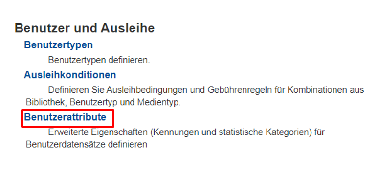

Nun können Sie ein neues Benutzerattribut hinzufügen. In diesem Beispiel wurde das Attribut "Schulklasse" gewählt, welches für Schulbibliotheken nützlich sein könnte.

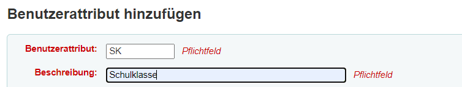

Haben Sie ein Attribut und eine zugehörige Beschreibung hinzugefügt, so können Sie dies abspeichern. Ihr konfiguriertes Attribut sollte nun in der Tabelle der Attribute erscheinen.

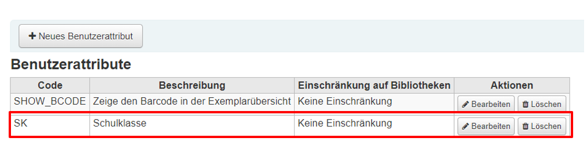

In den Formularen der Benutzererfassung erscheint Ihr konfiguriertes Attribut unter der Kategorie "Weitere Eigenschaften und Kennungen".

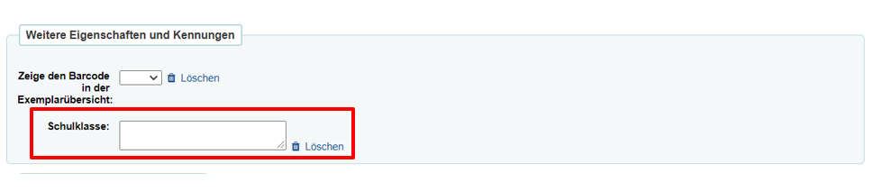

## Benutzerschnellerfassung

Wenn Sie viele Kunden in der Bibliothek haben, so bleibt vermutlich wenig Zeit, um Neukunden in die gesamten Erfassungsformulare einzutragen. In diesem Fall hilft Ihnen die Benutzerschnellerfassung weiter. Sie erreichen diese, indem Sie wie gewohnt von der Startseite aus auf die Benutzer gehen und anschließend den Button "Benutzerschnellerfassung" auswählen.

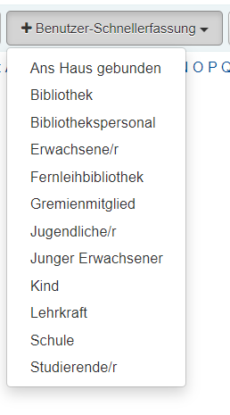

Anschließend erscheint ein verkürztes Formular zur Erfassung von neuen Benutzern. In dieses ist nur der Nachname verpflichtend einzutragen. 

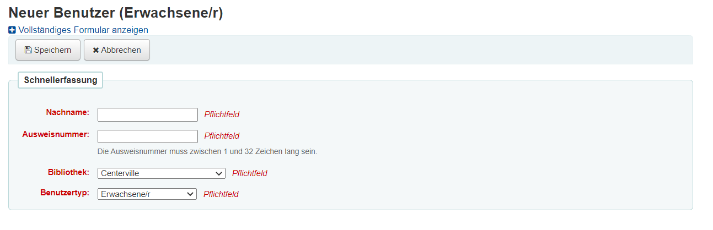

## Suchen von Benutzern

In der Suchleiste, welche sich ebenfalls auf der Benutzer-Oberfläche befindet, können die Benutzer:innen gesucht werden. Dies geschieht mithilfe der Ausweisnummer des Bibliotheksausweises oder dem Namen des Benutzers. In diesem Beispiel wird die Benutzerin "Maria Musterfrau" gesucht.

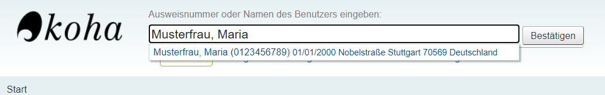

Zusätzlich werden verschiedene Filteroptionen links unterhalb der Suchleiste oder über das Zeichen rechts neben der Suchleiste angezeigt.

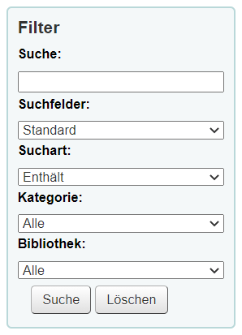

Wenn Sie das gesuchte Benutzerkonto geöffnet haben, so können Sie in der oberen Spalte verschiedenen Optionen sehen, welche weitestgehend selbsterklärend sind.

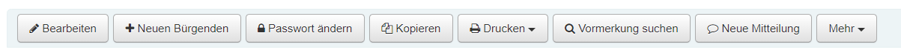

Wenn Sie den Button "Mehr" auswählen, erscheinen noch weitere Möglichkeiten, wie beispielsweise das Verlängern des Benutzerausweises. Zusätzlich kann im Feld "Kontodaten" das Ablaufdatum des Bibliotheksausweises verlängert werden.

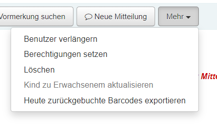

Auch am Rand der Seite gibt es verschiedene Reiter, mit denen Sie zwischen den unterschiedlichen Themengebieten des Benutzers wechseln können. 

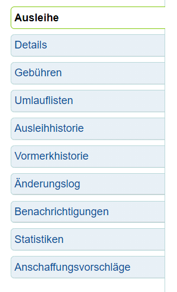

Eine weitere wichtige Option, die das Öffnen eines bestimmten Benutzerkontos enthält, ist die Übersicht über die verschiedenen Medien des Nutzers. Mithilfe dieser Tabelle können Sie sich die Ausleihen und Vormerkungen des Benutzers anschauen. 

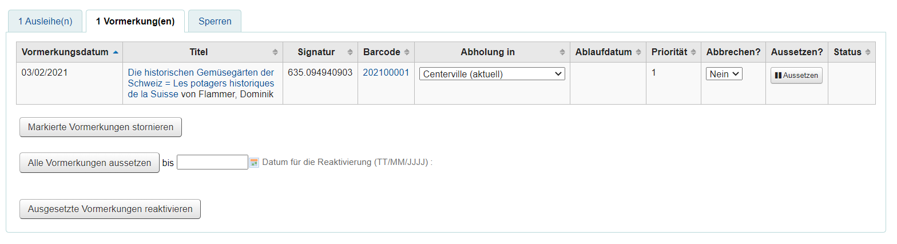

**Eintragen einer Notiz:** Um eine Notiz in einem Benutzerkonto einzutragen, sollten Sie sich erneut auf dem Ausleihfenster von Koha befinden. Nun öffnen Sie das Konto des gewünschten Nutzers über die Suchleiste. Daraufhin wählen Sie den Button "Neue Mitteilung" aus. In der sich geöffneten Maske wählen Sie aus, ob die Benachrichtigung intern oder extern sein soll.

Außerdem fügen Sie in das Textfeld die Benachrichtigung für den Nutzer ein. Die Auswahl wird anschließend mit dem Button "Speichern" bestätigt. 

**Abrufen von Notizen:** Möchten Sie eine Übersicht über die bereits versendeten Benachrichtigungen eines Nutzers, so wählen Sie, nachdem das entsprechende Konto geöffnet wurde, den linken Reiter "Benachrichtigungen" aus. 

## Bearbeiten von Benutzerdatensätzen

Um den Datensatz eines Benutzers zu bearbeiten, muss zuerst das dazugehörige Konto geöffnet werden. Dafür sollte das Ausleihfenster von Koha geöffnet sein. Geben Sie dafür den Namen oder die Ausweisnummer des Nutzers in die Suchleiste ein. Über den Button "Bearbeiten" öffnet sich die Änderungsmaske des Nutzerdatensatzes.

Nun können verschiedenen Änderungen der Einstellungen vorgenommen werden.

**Sperren des Benutzerkontos:** In den Feldern "Sperren" und "Benutzersperren" können Nutzer gesperrt werden. Beispielsweise wenn sie Ihren Bibliotheksausweis verloren haben. Für das Sperren von Benutzern kann manuell ein Ablaufdatum der Sperre eingetragen werden. Zusätzlich kann vermerkt werden, aus welchem Grund das Konto temporär gesperrt ist.

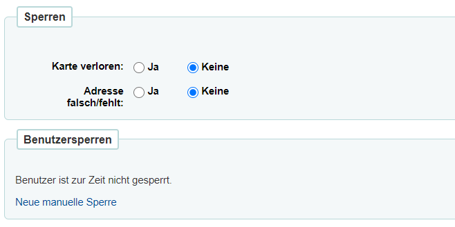

Wird nun die Auswahl "Karte verloren" gewählt, so erscheint folgende Notiz bei dem Konto des Nutzers. 

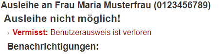

## Weitere Informationsquellen

* <a href="https://wiki.bsz-bw.de/pages/viewpage.action?pageId=17565617&preview=/17565617/3454267/18-11_Handbuch_Benutzerverwaltung.pdf">BSZ: Koha Handbuch Benutzerverwaltung</a>
* <a href="https://koha-community.org/manual/20.05/de/html/patrons.html">Koha Manual 20.05 Dokumentation: Benutzer</a>
