# Erwerbung
Um in Koha Bestellungen verarbeiten zu können, müssen zuerst einige Einstellungen vorgenommen werden, um den Haushalt in Koha zu erfassen und zu verwalten.
Der Haushalt besteht setzt sich aus Etats und zugehörigen Konten zusammen. Einem Etat können beliebig viele Konten und Unterkonten zugeordnet werden. Grundsätzlich kann der Haushalt nach Belieben untergliedert werden, jedoch ist eine Unterteilung in zwei Ebenen, in Etat und die dazugehörigen Konten, empfehlenswert.

## Etats
Der Etat bildet die oberste Stufe der Haushaltsstruktur. Meist bezieht sich dieser auf eine Zeitspanne, beispielsweise ein Jahr.

Um in Koha Bestellungen anlegen zu können, muss zuerst ein Etat definiert werden.
### Etats anlegen
Die betreffenden Funktionen finden sich ausgehend von der Koha-Startseite bei der Schaltfläche „Erwerbung“.

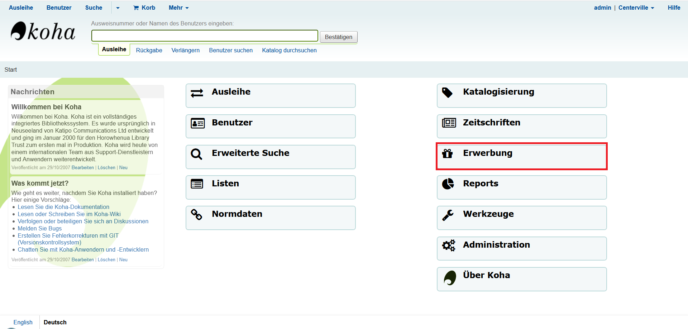
 
Ist zuvor noch kein Etat konfiguriert worden, weist Koha nun darauf hin, dass ein neuer Etat definiert werden muss. Durch einen Klick auf den entsprechenden gelb hervorgehobenen Link gelangt man direkt zur Etatverwaltung. Alternativ kann diese auch links unter *„Administration“ > „Etats“* ausgewählt werden.
 
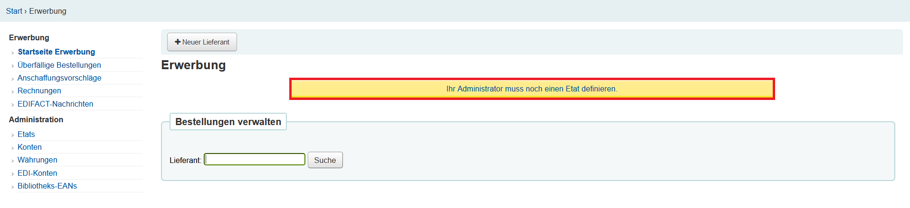
 
Es sind keine Etats vorhanden. Mit der Schaltfläche „Neuer Etat“ öffnet sich eine Maske, um einen neuen Etat anzulegen.
 
 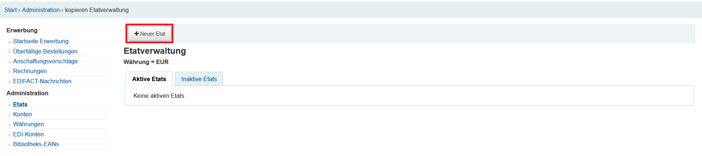
 
 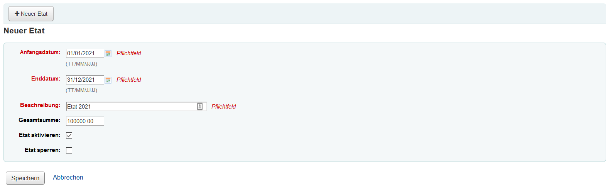
 
Die Pflichtfelder sind rot hinterlegt.

**Anfangs- und Enddatum:** Die hier angegebenen Daten müssen nicht dem aktuellen Kalenderjahr entsprechen.

**Beschreibung:** Der Name des Etats, der in der Übersicht angezeigt werden soll.

**Gesamtsumme:** Die insgesamt verfügbaren Mittel.

**Etat aktivieren** muss unbedingt angehakt werden, damit auf den betreffenden Etat Bestellungen getätigt werden können. 
Ein Etat kann auch über das Haushaltsjahr hinaus seine Gültigkeit behalten und aktiv bleiben. So können Bestellungen, die im vorangegangenen Haushaltsjahr bestellt wurden, immer noch bearbeitet werden. Es kann auch ein Etat für das Folgejahr vor der eigentlichen Laufzeit aktiviert werden, sodass Bestellungen, die im alten Jahr getätigt aber erst im neuen Jahr geliefert werden, bereits auf den neuen Etat gebucht werden können.

Durch einen Klick auf die Schaltfläche „Speichern“ wird der neue Etat angelegt und erscheint anschließend in der Etatverwaltung.
 
## Konten
Für einen Etat können beliebig viele Konten angelegt werden, die wiederum in Unterkonten unterteilt werden können. Die Funktion findet man beim jeweiligen aktiven Etat unter *"Aktionen“ > „Konto hinzufügen"*.
 
 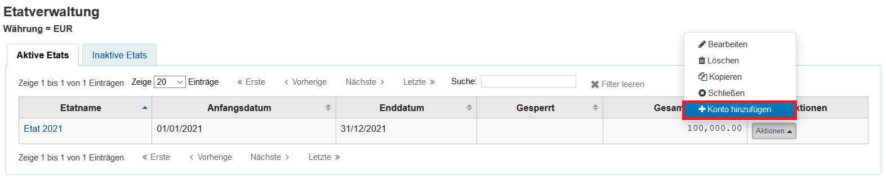
 
 Es öffnet sich anschließend die Maske zur Erfassung des neuen Kontos.
 
 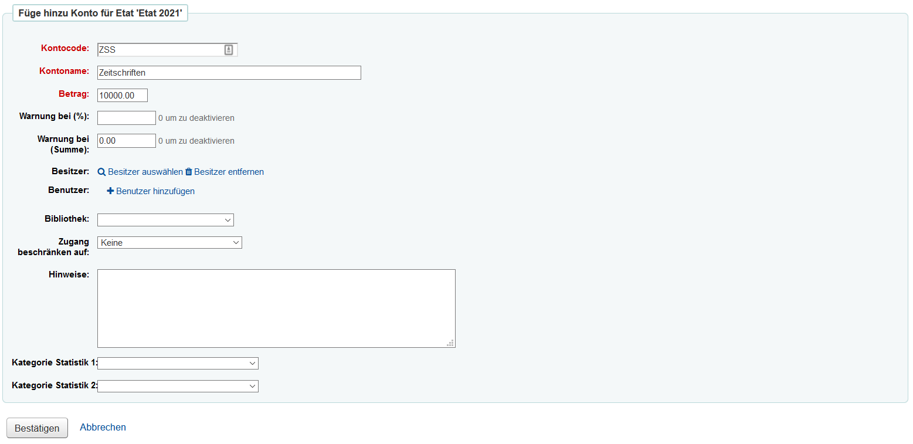
 
**Kontocode:** Der Kontocode wird dazu verwendet, noch offene Bestellungen am Ende des Jahres von einem Etat auf den anderen zu übertragen. Er sollte daher keine Jahresangaben enthalten sondern möglichst allgemeingültig sein (z. B. *nicht* ZS2020, sondern nur ZS).

**Kontoname:** Der Kontoname gibt den geplanten Verwendungszweck des Kontos an.
Betrag: Der Betrag kann beliebig gewählt werden, darf die für den Etat eingetragene Summe bzw. die nach Anlegen anderer Konten noch verfügbaren Mittel nicht überschreiten.

**Warnung bei % / Warnung bei Summe:** Diese Funktion prüft die gebundenen und ausgegebenen Mittel für das jeweilige Konto. Übersteigt diese Summe den hier angegebenen Wert, wird eine Warnmeldung erzeugt, die aber übersprungen werden kann. Es ist auch möglich, Konten zu überziehen.

**Besitzer / Benutzer / Bibliothek:** Mit diesen Feldern kann festgelegt werden, wer das Konto verwenden kann.  

**Zugang beschränken auf:** Durch diese Schaltfläche kann ausgewählt werden, welche der oben definierten Gruppen/Personen Zugriff auf das Konto haben soll. Standardmäßig ist keine Beschränkung vorhanden.

**Hinweise:** Hier kann optional definiert werden, wozu das Konto verwendet werden soll.

**Kategorie Statistik 1/2:** Hier können Kategorien von normierten Werten angegeben werden, die für die Erstellung von Statistiken relevant sind. Diese können unter Administration - normierte Werte definiert werden.

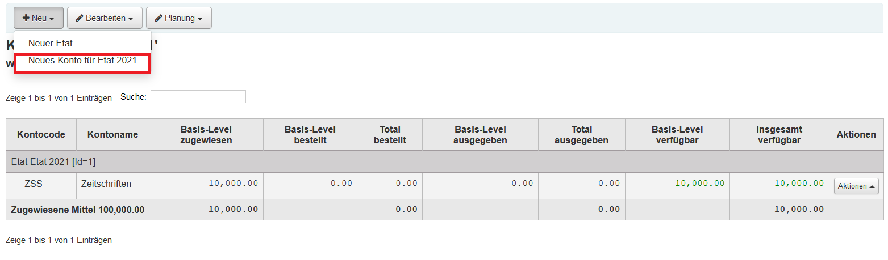
 
Unter *"Erwerbung" > "Administration" > "Konten"* kann eine Übersicht aller Konten der jeweiligen Etats angezeigt werden. Die Übersicht liefert eine Übersicht, wie viele Mittel bereits durch offene Bestellungen gebunden, ausgegeben oder noch frei verfügbar sind.
### Unterkonten anlegen
Die Funktion zum Anlegen neuer Unterkonten findet sich unter *Erwerbung > Administration > Konten.* Hier kann für jedes Konto unter „Aktionen“ und „neues Unterkonto“ eine beliebige Anzahl Unterkonten angelegt werden. Die Maske wird analog zu der Maske für normale Konten befüllt.

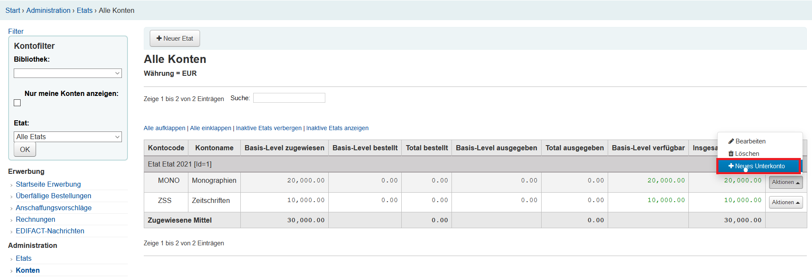
 
### Etats abschließen
Meist am Ende des Haushaltsjahres müssen Etats abgeschlossen werden. Zuerst sollte der derzeit aktive Etat auf inaktiv gesetzt werden. So wird verhindert, dass irrtümlich neue Bestellungen auf Konten in diesem Etat angelegt werden. Die Bearbeitung von Lieferungen und die Rechnungsbearbeitung ist auch bei inaktiven Etats weiterhin möglich.

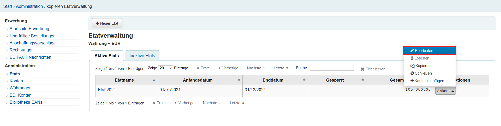
 
Hierzu wird über Erwerbung > Etats die Etatverwaltung aufgerufen. Nun wird beim betreffenden Etat über „Aktionen“ und „bearbeiten“ die Bearbeitungsmaske aufgerufen.

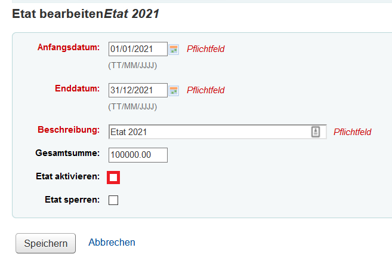
 
Hier muss bei „Etat aktivieren“ der Haken entfernt und auf „Speichern“ geklickt werden. Der Etat ist nun in der Etatverwaltung unter dem Reiter „inaktive Etats“ zu finden.

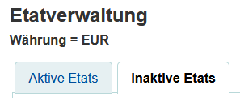
 
### Etats kopieren
Sind bereits (aktive oder inaktive ) Etats vorhanden, können diese kopiert und somit als Vorlage für den neuen Etat verwendet werden. Hierfür muss beim zu kopierenden Etat „Aktionen“ und „kopieren“ ausgewählt werden.
 
 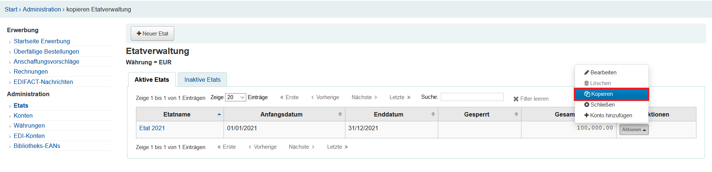
 
In der sich öffnenden Maske muss nur noch das Anfangs- und Enddatum sowie die Beschreibung angepasst werden.
Gibt es Änderungen in der zugewiesenen Etatsumme, kann diese bei „Beiträge ändern um“ durch eine Angabe in % erhöht oder reduziert werden.

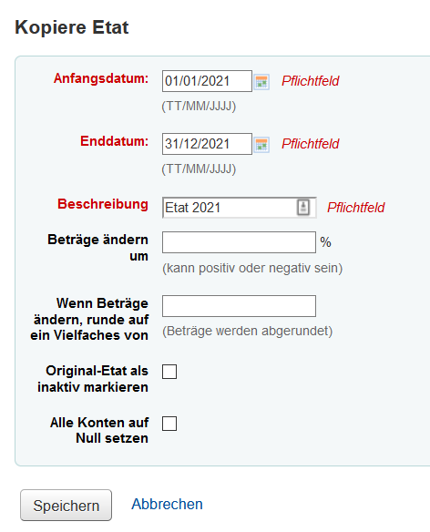
 
### Bestellungen umbuchen
Noch offene Bestellungen können automatisch von einem Etat in das nächste Jahr übernommen werden. Voraussetzung hierfür ist, dass die Kontencodes der Konten der jeweiligen Etats übereinstimmen.
In der Etatverwaltung muss beim alten Etat unter „Aktionen“ auf „schließen“ geklickt werden.

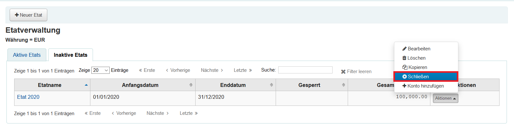
 
Sind noch offene Bestellungen vorhanden, wird eine Übersicht der Bestellungen gegliedert nach den einzelnen Konten angezeigt. Diese können nun, sofern es im neuen Etat Konten mit denselben Kontocodes gibt, auf einen im Dropdown-Menü auszuwählenden neuen Etat umgebucht werden.
Es gibt die Möglichkeit, verbliebene Mittel auf den neuen Etat umzubuchen. Dies sollte nur angehakt werden, wenn die Mittel aus dem alten Jahr auch wirklich im neuen Jahr zur Verfügung stehen.

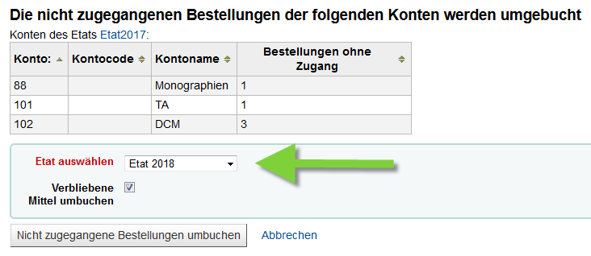
 
Mit „nicht zugegangene Bestellungen umbuchen“ wird der Vorgang begonnen, es wird allerdings noch einmal eine Bestätigung des Vorgangs verlangt, die mit „OK“ bestätigt werden muss. Können alle offenen Bestellungen korrekt umgebucht werden, steht die Summe der gebundenen Mittel im Ausgangsetat auf Null und die Mittel sind im neuen Etat gebunden.
 
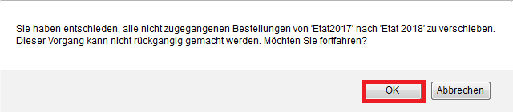
