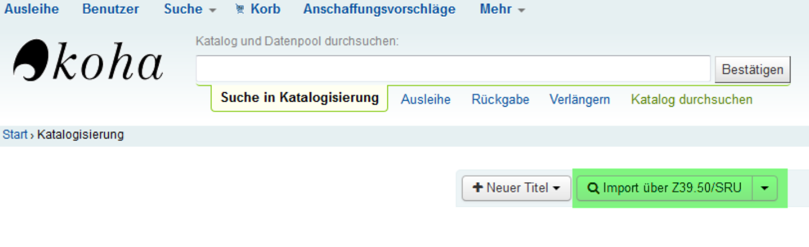

# Katalogisierung
Der Begriff Katalogisierung beschreibt den Prozess der Erfassung von beschreibenden Metadaten zu den jeweiligen Medien der Bibliothek. Jedes in den Bestand eingehende Medium muss im Bibliothekssystem erfasst werden, um später in der Recherche im Katalog auffindbar zu sein. Der öffentliche Online Katalog wird auch als OPAC (Online Public Access Catalogue) bezeichnet .
Um eine erfolgreiche Recherche zu gewährleisten, muss bei der Erfassung der Daten – der Katalogisierung – ein vorgegebener Standard eingehalten werden.

## Titel- und Exemplardatensätze
Im Prozess der Katalogisierung muss zwischen zwei wichtigen Begrifflichkeiten differenziert werden: Zuerst erstellen Sie einen sogenannten **Titeldatensatz**, der die beschreibenden Metadaten des Objektes enthält. 

Dieser kann auch mit Hilfe des Tools **Z39.50** aus einer Datenquelle übernommen werden, beispielsweise dem Verbundskatalog K10plus. Ein Verbundkatalog wird in Kooperation mehrerer Bibliotheken gepflegt, und weist daher einen hohen Qualitätsstandard vor.

Für den eigenen Katalog muss allerdings noch ein sogenannter **Exemplardatensatz** angelegt werden, das direkt mit einem einzelnen Objekt im Bestand korrespondiert. 
So liegt beispielsweise für einen Buchtitel im Bestand jeweils nur ein Datensatz vor, sollten aber mehrere Ausgaben desselben Buches vorhanden sein, erhält jede ihren eigenen Exemplardatensatz. Dieser kann auch Daten enthalten, die einzigartige Merkmale der jeweiligen Ausgabe beschreiben, beispielsweise der Standort in der Bibliothek oder markante Beschädigungen. Da der Exemplardatensatz individuell angepasst werden muss, kann er nicht aus einer Datenquelle wie dem K10plus übernommen werden.

Sowohl der Titeldatensatz als auch der Exemplardatensatz nutzen ein Datenformat, das vorschreibt welche Felder angegeben werden können und wie diese ausgefüllt werden sollen. Dieses Datenformat heißt MARC (machine-readable cataloging). Wie der Name verrät, ermöglicht es dass die Daten von allen Bibliothekssystem korrekt interpretiert werden. Den sogenannten **MARC Feldern** werden jeweils eine Nummer und eventuellen untergeordneten Feldern ein Buchstabe zur Identifikation zugeordnet.

## Übernahme des Titeldatensatzes mit Z39.50
Im Unterpunkt "Katalogisierung" von Koha finden Sie die Import Funktion von Z39.50.

<!--  -->

Der Button öffnet ein separates Fenster mit der Suchmaske des Tools.

<!--[Bild der Suchmaske](../Images/z3950_suchmaske.png) -->

Hier können verschiedene Suchkriterien eingegeben werden, um in mehreren Suchzielen zu recherchieren. Die potentiellen Suchziele müssen zuvor in Koha konfiguriert worden sein (s. Z39.50).
Sollte an Ihren Rechner ein Barcode Scanner angeschlossen sein, können Sie diesen nutzen, um die ISBN des Mediums zu scannen und automatisch in die Suchmaske einzutragen.

<!-- -->

Nach einer erfolgreichen Suche sollte ein oder mehrere Ergebnisse vorliegen. Im Fall von mehreren Ergebnissen wählen Sie bitte den vollständigsten Datensatz, sprich der Datensatz mit den meisten Angaben in der Tabelle. Besonders sollte auf die Übereinstimmung der ISBN geachtet werden.
Haben Sie einen Datensatz ausgewählt, können Sie diesen unter „Aktionen“ importieren.

Nach dem erfolgreichen Import sollte Ihnen eine Übersicht des Datensatzes angezeigt werden, den Sie auf Vollständigkeit überprüfen können. Zusätzlich müssen Sie eigenhändig die Angabe zum „Koha-Medientyp“ machen. Diese finden sie unter dem Reiter "9", im MARC Feld 942 - c. Wählen Sie den Medientyp, der Ihrem vorliegenden Medium entspricht.

Sind Sie mit dem Datensatz zufrieden, können Sie die Übernahme mit der Schaltfläche „Speichern“ abschließen.

## Vereinfachte Katalogisierung mit Hilfe eines importierten Frameworks
Alternativ zur Datenübernahme mit Z39.50 kann die Katalogisierung auch wesentlich erleichtert werden, indem ein sogenanntes „bibliographic framework“ importiert wird, das auf die essentiellen MARC Felder reduziert wurde. Somit wird die Erfassungsmaske in Koha wesentlich überschaubarer und ist einfacher zu nutzen.
Eine solche vorgefertigte Datei finden Sie <a href="https://pders01.github.io/Koha_out_of_the_box/schulbib_framework.ods" download>hier</a>.

Die Datennsätze müssen dann per Hand angelegt werden, und können nicht bereits vollständig übernommen werden. Aufgrund des verminderten Umfangs sollte dies allerdings nur wenig Zeit in Anspruch nehmen.

<!--[schulbib_framework.ods](https://pders01.github.io/Koha_out_of_the_box/schulbib_framework.ods)
<a href="schulbib_framework.ods" download>Click to Download</a>
<a href="https://pders01.github.io/Koha_out_of_the_box/schulbib_framework.ods" download>Click to Download</a> -->

### Einrichtung des Frameworks
Nachdem Sie die oben verlinkte Datei heruntergeladen haben, fahren Sie wie folgt fort.

In der Koha Administration finden Sie im Unterbereich "Katalog" die Möglichkeit das Bibliografische MARC-Framework zu bearbeiten.

Hier besteht neben der Bearbeitung der bestehenden Frameworks auch die Option, ein neues anzulegen, welche wir nutzen werden. 

Das neue Framework kann nach Belieben benannt werden. In diesem Beispiel wurde stellvertretend "NEU" als Kurzform und "Neues Framework" als voller Titel genutzt. Unter dem Namen, den Sie hier wählen, finden Sie das Framework später wenn Sie einen neuen Titeldatensatz anlegen möchten.

Nachdem Sie den Namen des neuen Frameworks bestätigt haben, wird dieses in der Übersicht angezeigt.

Unter "Aktionen" können die Frameworks bearbeitet werden. Hier könnten Sie bei Bedarf auch die ungenutzten Frameworks löschen, um mögliche Verwechslungen zu vermeiden. Allerdings ist hierbei zu beachten, dass die Löschung endgültig ist und die bestehenden Frameworks verloren gehen.

Wählen Sie unter den Aktionen des neuen Frameworks "Import" aus, um die Datei, die sie zuvor heruntergeladen haben, hochzuladen. Ist dieser Vorgang erfoglreich, öffnet sich das Framework automatisch.

An diesem Punkt ist das Framework betriebsbereit und kann wie in **Erstellen eines Titeldatensatz mit dem importierten Framework** beschrieben genutzt werden. Es folgen einige zusätzliche Informationen, die nur relevant sind falls Sie sich genauer mit der Bearbeitung eines Frameworks befassen möchten.

In der Übersicht sind die MARC Felder des Frameworks zu sehen, die jeweils noch eigene Unterfelder haben. Unter "Aktionen" können diese angezeigt werden.

Unter "Bedingungen" ist hier schon ein wichtige Eigenschaft der Unterfelder zu erkennen: "Teilfeld ignoriert" bedeutet, dass dieses bei der Erstellung und Bearbeitung des Titeldatensatzes nicht auftaucht. Weniger Unterfelder ist ein wichtiger Faktor um den Datensatz übersichtlicher zu strukturieren. Unter "Bearbeiten" kann unter anderem angepasst werden, ob das Unterfeld ignoriert wird oder nicht.

Soll das Unterfeld genutzt werden, muss in den Basiskonfigurationen angepasst werden in welchem Reiter es angezeigt werden soll. Standardmäßig sollte hier "0" genutzt werden, um das Unterfeld anzuzeigen. Eine weitere wichtige Basiskonfiguration, die angepasst werden kann, ist ob es sich um ein Pflichtfeld handelt oder nicht. Des weiteren kann auch der Titel geändert werden, sollte dieser nicht selbsterklärend genug sein.
Unter "Weitere Optionen" findet man die Normwerte. Diese können, wie in der **Konfiguration** erleutert, angelegt werden und hier als Auswahloptionen für das Feld festgelegt werden. Dies ist eine weitere Option um die Erstellung eines Titeldatensatzes zu erleichtern.

### Erstellen eines Titeldatensatz mit dem importierten Framework

Im Unterbereich Katalogisierung von Koha findet sich der Button um einen neuen Titel anzulegen. Hier kann man das Framework auswählen, das man für den Titel nutzen möchte. Bitte wählen Sie das Framework, dass Sie zuvor erstellt haben.

Nachdem das Framework ausgewählt wurde, öffnet sich ein Editor in dem die passenden Angaben in den MARC Feldern gemacht werden müssen.

Die folgende Tabelle erläutert alle Felder, die das bearbeitete Framework standardmäßig für einen Titeldatensatz anbietet. Nicht alle von ihnen müssen zwingend ausgefüllt werden, vollständige Angaben sind allerdings immer zubevorzugen. Die wesentlichen Pflichtfelder, die jeder Datensatz beinhalten muss, sind in der Tabelle mit einem Sternchen markiert. Des weiteren verlinkt die Feldnummer auf eine genauere Erläuterung, deren Komplexität allerdings oft über das hinausgeht, was von Schulbibliotheken benötigt wird.

MARC Feld | Unterfeld | Erläuterung
--------- | ----------- | -----------
<a href="https://koha-wiki.thulb.uni-jena.de/erschliessung/katalogisierung/handbuecher/020-internationale-standardbuchnummer-isbn/">020</a> | a | **ISBN (ohne Bindestriche)**: In diesem Feld wird die ISBN des Mediums eingetragen, im normalen Format ohne Bindestriche. Dies kann mit einem Handscanner automatisiert werden.
<a href="https://koha-wiki.thulb.uni-jena.de/erschliessung/katalogisierung/handbuecher/041-sprachcode/">041*</a>  | a | **Sprachcode**: Hier wird die Sprache des Mediums dem ISO 639.2 entsprechend in Kurzform angegeben. Für deutsch wird **„ger“** verwendet, für englisch **„eng“**. Weitere Sprachcodes finden Sie <a href="http://www.gbv.de/bibliotheken/verbundbibliotheken/02Verbund/01Erschliessung/02Richtlinien/02KatRichtRDA/anhaenge/anhang-sprachcodes">hier</a>.
<a href="https://koha-wiki.thulb.uni-jena.de/erschliessung/katalogisierung/handbuecher/100-haupteintragung-personenname/">100*</a>  | a | **Person als geistiger Schöpfer**: Einfach gesagt wird hier der **Autor** des Werkes im Format **Nachname, Vorname** angegeben.
<a href="https://koha-wiki.thulb.uni-jena.de/erschliessung/katalogisierung/handbuecher/245-haupttitel-titelzusatz-verantwortlichkeitsangabe/">245*</a> | a | **Titel**: Der Name des Mediums, beispielsweise der Buchtitel.
<a href="https://koha-wiki.thulb.uni-jena.de/erschliessung/katalogisierung/handbuecher/245-haupttitel-titelzusatz-verantwortlichkeitsangabe/">245</a> | b | **Titelzusatz**: Sollte das Medium einen zweiten Titel, den sogenannten **Untertitel**, besitzen, kann dieser in diesem Feld angegeben werden.
<a href="https://koha-wiki.thulb.uni-jena.de/erschliessung/katalogisierung/handbuecher/250-ausgabebezeichnung/">250</a> | a | **Ausgabebezeichnung**: Hier handelt es sich in der Regel um die **Auflage** eines Buches. Diese zu vermerken ist hauptsächlich relevant, falls es zu unterschieden zwischen den verschiedenen Auflagen kommen kann, beispielswiese bei Schulbüchern.
<a href="https://koha-wiki.thulb.uni-jena.de/erschliessung/katalogisierung/handbuecher/264-veroeffentlichungsangabe/">264</a> | a | **Erscheinungsort**: Diese Angabe ist bei Büchern meist auf der Titelseite zu finden und hängt vom Standort des Verlages ab.
<a href="https://koha-wiki.thulb.uni-jena.de/erschliessung/katalogisierung/handbuecher/264-veroeffentlichungsangabe/">264</a>  | b* | **Name des Verlags**: Auch diese Angabe ist, wenn nicht auf dem Buchrücken, auf der Titelseite zu finden.
<a href="https://koha-wiki.thulb.uni-jena.de/erschliessung/katalogisierung/handbuecher/264-veroeffentlichungsangabe/">264</a>  | c* | **Erscheinungsjahr**: Hierbei bezieht man sich auf die vorliegende Ausgabe und nicht zwingend auf die Ersterscheinung. Auch diese Angabe ist auf der Titelseite zu finden.
<a href="https://koha-wiki.thulb.uni-jena.de/erschliessung/katalogisierung/handbuecher/300-physische-beschreibung/">300</a>  | a | **Physische Beschreibung**: Bei Büchern wird hier die Seitenzahl angegeben.
<a href="https://koha-wiki.thulb.uni-jena.de/erschliessung/katalogisierung/handbuecher/500-allgemeine-fussnote/">500</a> | a | **Allgemeine Fußnote**: Dies ist ein freies Feld, das für jegliche Anmerkungen genutzt werden kann.
942* | a | **Medientyp**: Koha bietet eine normierte Auswahlmöglichkeit für dieses Feld, das angibt um welche Form von Medium es sich handelt.

## Erstellen eines Exemplardatensatzes

Sowohl nach dem manuellen Anlegen eines Titeldatensatzes als auch nach der Übernahme mit Hilfe von Z39.50 öffnet sich automatisch die Maske zur Erstellung eines Exemplardatensatzes.

Alternativ kann ein bestehender Titeldatensatz ausgewählt werden um ein Exemplar hinzuzufügen.

### MARC Felder im Exemplardatensatz
Die Felder des Exemplardatensatzes müssen manuell mit den richtigen Informationen ausgefüllt werden. Um den Aufwand möglich gering zu halten, kann man sich auf ein Minimum konzentrieren.

Die folgenden Exemplarfelder sind lediglich eine Empfehlung, es steht natürlich jeder Bibliothek frei dem individuellen Bedürfnissen entsprechende Anpassungen zu machen. Allerdings sollten die gewählten Pflichtfelder früh festgelegt und durchgängig genutzt werden, um einen einheitlichen Standard für den Katalog zu gewährleisten.
Exemplardatensätze können jederzeit bearbeitet und ergänzt werden.

MARC Feld | Name | Erläuterung
--------- | ----------- | ----------
8 | Sammlung | In diesem Feld kann die Angehörigkeit zu einer Sammlung oder einem Themenbereich angegeben werden. Die normierten Auswahlmöglichkeiten können in der **Konfiguration** unter CCODE angepasst werden. Standardmäßig wird hier unter Bellestrik, Sachliteratur und Nachschlagewerken unterschieden.
c | Aufstellung | Hier wird der Standort innerhalb der Bibliothek angegeben. Auch diese normierten Angaben können unter LOC konfiguriert werden, um an individuelle Räumlichkeiten und Aufstellungen angepasst werden zu können. Standardmäßig werden hier Abteilungen wie Kinderbibliothek oder Belletristik angegeben.
o | Signatur | In diesem Feld wird die individuelle Signatur des Exemplares vermerkt, die meist auch auf dem Medienetikett zu finden ist, beispielsweise auf dem Buchrücken. Genauere Informationen finden Sie unter **Systematik und Signatur**.
p | Barcode | Der Barcode Ihres Mediums dient zur einfach Ausleihe und Rückgabe mit Hilfe eines Handscanners. In der Konfiguration sollte die automatische Erstellung eines Barcodes aktiviert sein, die durch ein einfaches Klickes in das Feld ausgelöst wird.

## Systematik und Signatur

### Systematik 
Mit „Systematik“ bezeichnen Bibliotheken ihr Ordnungssystem, dass die verschiedenen Themenbereiche und Gruppierungen des Bestandes abbildet. Diese kann bei Bedarf auf den Bestand angepasst werden, oft werden aber auch einfach vorgefertigte Systematiken genutzt. Für Schulbibliotheken ist eine vereinfachte Form einer komplexeren Systematik entwickelt worden, die <a href="http://www.sfb-online.de/wiki/index.php?title=Hauptseite">hier</a> verfügbar ist.

Die thematische Unterteilung, wie beispielsweise für die Sachgruppen, ist bereits auf der obersten Ebene nutzbar. So können Bücher aus dem Sachbereich Biologie unter "Bio" klassifiziert werden. Sollten allerdings in diesem Sachbereich besonders viele Bücher vorliegen, die besser 

### Signatur
Verkürzte Angabe der Systematik für den Buchrücken, oft mit Kurzform des Autoren Nachnamens um eine alphabetische Anordnung im Regal zu ermöglichen

