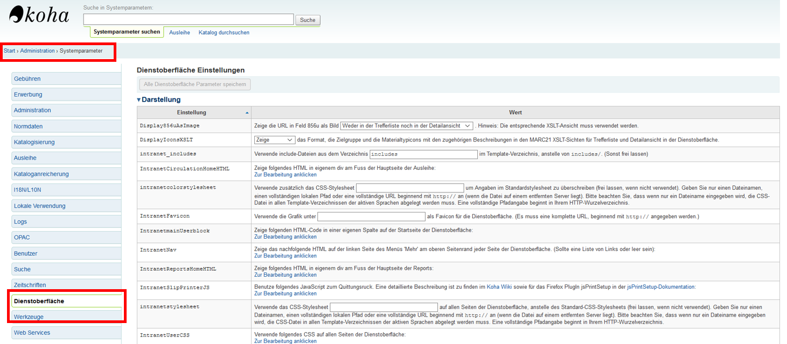

# Admin-Oberfläche

Die Systemparameter zur bearbeitung der Admin-Oberfläche finden Sie auf der Admin-Oberfläche unter *„Administration* > „Systemparameter“* auf der Seite Dienstoberfläche. 

Bei der Aufsetzung Kohas sollte Sie zunächst den folgenden zwei Schritten folgen.

**staffClientBaseURL**

Über diesen Parameter wird die Basis-URL der Dienstoberfläche festgelegt. Hier sollten Sie eine vollständige URL angeben, wobei diese keinen Schrägstrich am Ende der Zeichenfolge enthalten darf. Diese Einstellung ist nicht absolut notwendig, ist aber empfehlenswert, da sie für die Funktion mancher Vorgänge benötogt wird.

**noItemTypeImages**

Dieser Parameter sollte ebenfalls bearbeitet werden, hier wird festgelegt, ob ind er Admin-Oberfläche Icons zur Darstellung des Medientypens von Werken angezeigt werden. Um möglichst stark die Kapazitäten des Raspberry Pi  zu schonen, sollte diese Option deaktivert werden. Hierbei wird die Funktionalität Kohas nicht beeinträchtigt, da automatisch als Ersatz der Medientyp in textform angezeigt wird.
Es kann hier in einem Dropdown-menü zwischen den Optionen ‚Ja‘ und ‚Nein‘ gewäht werden, wobei ersteres die Standardeinstellung ist. Wählen Sie hier die Option ‚Nein‘.
Um die selbe Einstellung für den OPAC zu bearbeiten, schauen Sie bitte im Bereich OPAC unter OpacNoItemTypes.

## Design der Admin-Oberfläche

Die weiteren hier aufgeführten Systemparameter und möglichen Anpassungen sind nicht zwingend notwendig. Es handelt sich um Möglichkeiten der Individualisierung der Admin-Oberfläche, welche gegebenenfalls von Interesse sein könnten. Diese Parameter finden Sie ebenfalls unter *„Administration“ > „Systemparameter“* auf der Seite Dienstoberfläche.

**Favicon**

Zur Einbindung der Admin-Oberfläche in Ihre restlichen Web-Angebote können Sie Ihr eigenes Bibliotheks- oder Institutionslogo als Favicon einbinden. bei einem favicon handelt es sich um ein kleines Icon, welches in den meisten Browsern links neben der URL eingeblendet wird. Dieses können Sie in dem Systemparameter IntranetFavicon ändern. Zum Einbinden muss hier eine vollständige URL angegeben werden. Standartmäßig wie hier ein Koha-Logo eingeblendet. Sie können Ihr eigenes favicon bei Bedarf etwa im [Favicon Generator](http://antifavicon.com/) erstellen.

**Eigene Designs**

Die Admin-Oberfläche kann ähnlich wie die OPAC-Nutzeroberfläche durch eigene CSS-Stylesheets und eingebetteten CSS, JavaScript und JQuery Code individualisiert werden.
Diese Einstellungen können alle in der Admin-Oberfläche unter *„Administration,“ > „Systemparameter“* auf der Seite Dienstoberfläche eingestellt werden.Hier gibt es die selben Optionen wie bei dem Koha-OPAC.

**intranetstylesheet**

Hier wird paralel zu opacuserstylesheet für den Koha-OPAC das grundlegende Stylesheet für die admin-Oberfläche definiert. Anders als beim OPAC ist dieses Feld allerdings leer , wenn das standardmäßige Stylesheet verwendet wird. Möchten Sie Ihr Stylesheet einbinden, können Sie einen kompletten lokalen Pfad verwenden oder nur de Dateinamen eingeben. In diesem Fall muss das Stylesheet in dem Ordner der verwendeten Sprache abgespeichert sein. Für weitere Informationen können Sie den Abschnitt opacuserstylesheet lesen. Das Verfahren ist hier identisch.

**intranetcolorstylesheet**

Hier können Sie ebenfalls ein eigenes Stylesheet einbinden, dieser Systemparameter funktioniert in der selben Weise wie OpacAdditionalStylesheet beim Koha-OPAC. Dieser Parameter wird primär zum Einstellen der Hintergrundfarbe und dem überliegenden Stil der Admin-Oberfläche verwendet. Es wird nicht das Basis-Stylesheet ersetzt sondern nur mit neuen Elementen ergänzt oder die selben CSS-Elemente mit neuen Werten überschrieben. Ebenso wie bei intranetstylesheet kann die Datei über einen lokalen Pfad oder über den Dateinamen eingefügt werden. Für eine erweiterte Erläuterung schauen Sie bitte unter OpacAdditionalStylesheet.
Möchten Sie diesen Systemparameter deaktivieren, müssen Sie diesen unausgefüllt lassen.

**IntranetUserCSS**

Ebenfalls identisch zu den Systemparametern des OPAC gibt es die Option, kurze CSS-Code Ausschnitte direkt in der Admin-Oberfläche einzubetten. Dieser Code überschreibt die hinterlegten Stylesheets aus intranetcolorstylesheet und intranetstylesheet. Diese Option bietet sich vor allem für das Testen und Umsetzen von kleineren Veränderungen des Designs an, da hier kein gesammtes Stylesheet erstellt und eingefügt werden muss.

**IntranetUserJS**

Über diesen Systemparameter gibt es ebenfalls die Option, JavaScript und JQuery einzubinden. Dieser Code wird auf allen Seiten der Admin-Oberfläche eingebettet und kann die interaktiven Elemente der Admin-Oberfläche beeinflussen. In der Koha Community [JQuery Library](http://wiki.koha-community.org/wiki/JQuery_Library) finden Sie Beispiele von JavaScript und JQuery Code, welcher in Koha von Nutzern eingebunden wurde.

# Weitere Informationsquellen

* <a href="https://koha-community.org/manual/20.11/en/html/administration.html">Koha 20.11 Dokumentation - Administration (Der Abschnitt zur Admin-Oberfläche in der offizielle Dokumentation zu Koha Version 20.11. Bisher ist keine deutsche Ausgabe vorhanden.
)</a>

* <a href="http://wiki.koha-community.org/wiki/JQuery_Library">JQuery Library(Eine Liste von verwendeten JQuery Snippets, welche auch teilweise zur Anpassungder Admin-Oberfläche genutzt werden können.)</a>

* <a href="https://wiki.koha-community.org/wiki/HTML_%26_CSS_Library">CSS und HTML Library(Liste von HTML und CSS Code-Snippets, welche zum anpassen der Admin-Oberfläche genutzt werden können. Der jeweils angepasste bzw. verwendete Systemparameter ist angegeben.)</a>