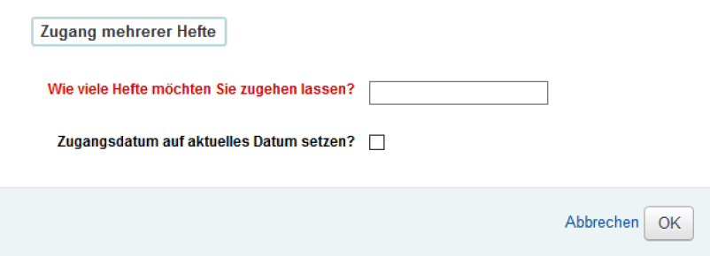
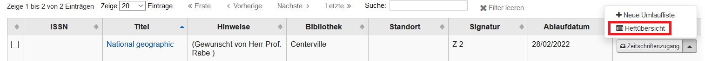
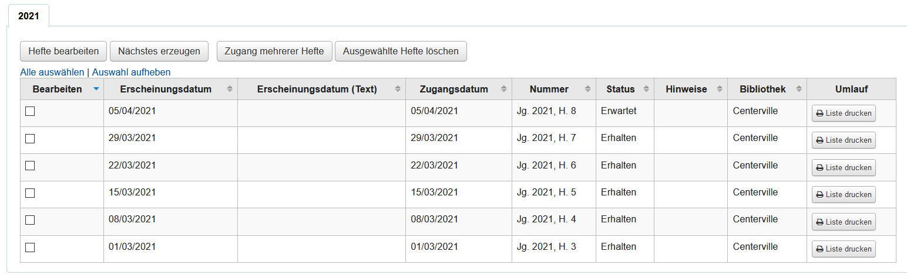
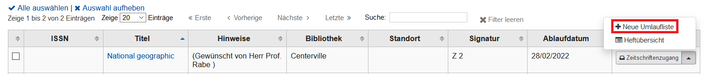
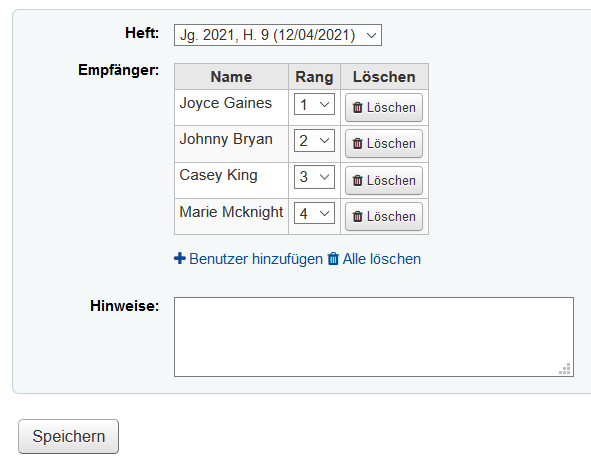
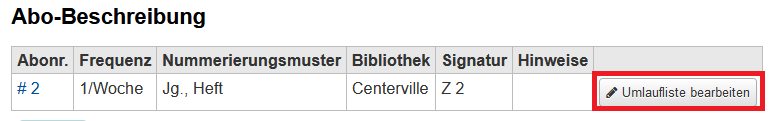
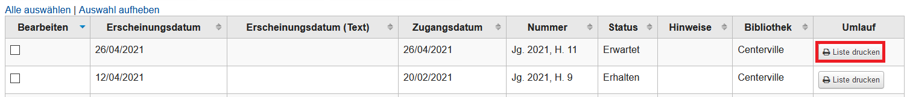
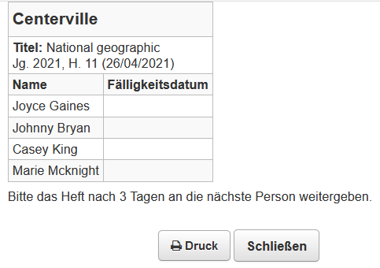

# Zeitschriften

Koha bietet umfangreiche Möglichkeiten, um Zeitschriften und Zeitungen im System zu erfassen und zu verwalten. Ein Vorteil hiervon ist, dass der vorhandene Zeitschriftenbestand somit sowohl für die Angestellten der Bibliothek als auch für interessierte Benutzer im OPAC ersichtlich ist.

Das Koha-Zeitschriftenmodul ist hilfreich, um einen Überblick zu haben, ob von der Bibliothek abonnierte Hefte pünktlich eintreffen oder möglicherweise eine Reklamation notwendig ist. Das Koha-Zeitschriftenmodul findet sich unter dem gleichnamigen Punkt auf der Koha-Startseite.

## Abonnements suchen
Im Zeitschriftenmodul findet sich ganz oben die Möglichkeit, nach bestehenden Abonnements zu suchen. Vorgegeben sind hier Felder für die ISSN und für den Titel. Die ISSN einer Zeitschrift findet sich meist im Impressum der einzelnen Hefte. Liegt kein Heft vor, kann auch in Katalogen wie beispielsweise der <a href="https://zdb-katalog.de/index.xhtml">ZDB</a> danach recherchiert werden, um ein Abonnement wirklich eindeutig zu identifizieren.

 
Bei Bedarf kann mit einem Klick auf „Erweiterte Suche“ auch nach mehr Aspekten wie beispielsweise der vergebenen Signatur, dem Verlag oder dem Lieferanten gesucht werden. Ein Abschicken der Suche ohne Eingabe liefert eine Liste aller angelegten Zeitschriftenabonnements.
Durch einen Klick auf den Titel der Zeitschrift in der Trefferliste gelangt man auf die Detailansicht des jeweiligen Abonnements.

## Neues Abonnement anlegen
 
Um ein neues Abonnement anzulegen, muss im Zeitschriftenmodul auf die Schaltfläche „Neues Abonnement“ geklickt werden.

 
Es öffnet sich eine Maske, in der die Abo-Details eingetragen werden müssen.

 
**Lieferant**: Hier muss die Lieferantennummer eingetragen werden. Mit der Schaltfläche „Lieferant suchen“ kann auch nach dem Namen gesucht werden. Die Angabe eines Lieferanten ist optional, wird aber für Reklamationen benötigt.

**Datensatz**: Ein Abonnement muss mit einem Datensatz verknüpft werden. Es kann entweder nach einem im vorhandenen Datensatz gesucht oder ein neuer angelegt werden.

Um hierfür eine vorher konfigurierte Z39.50-Schnttstelle zu verwenden, muss erst „Neuer Datensatz“ und anschließend die Schaltfläche „Z39.50/STRU-Suche“ ausgewählt werden. Im Suchformular kann nun nach der gewünschten Zeitschrift gesucht und ein geeigneter Datensatz mit „Import“ übernommen und gespeichert werden. Gegebenenfalls ist es hierbei leichter, die gesuchte Zeitschrift erst in einem Verbundkatalog (z. B. im <a href="https://opac.k10plus.de/">K10plus-OPAC</a>) zu recherchieren und anschließend den Datensatz mit der eindeutigen K10plus-PPN im Feld „Kontrollnr.“ zu suchen.

**Zeitschriftenzugang**: Es kann entschieden werden, ob für Zeitschriftenhefte zusätzlich Exemplare angelegt werden sollen. Auch ohne Exemplar werden die Hefte in der Dienstoberfläche und im OPAC angezeigt. Es empfiehlt sich daher der Einfachheit halber, „Bei Zugang kein Exemplar anlegen“ anzuhaken.

**Heftnummer**: Wenn die Nummerierung fortlaufend ist, sollte ‚Behalte Heftnummer‘ ausgewählt werden.

**Manuelle Historie**: Dies sollte im Normalfall nicht ausgewählt werden, da durch die ‚Manuelle Historie‘ die automatische Bestandsaufzeichnung durch Koha gestoppt wird und die Historie manuell bearbeitet werden muss.

**Signatur**: Es muss eine Signatur für die Zeitschrift vergeben werden (z. B. Z 1), die für die gesamte Zeitschrift gilt.

**Bibliothek**: Das Abonnement muss einer Bibliothek zugeordnet werden.

**OPAC-Notiz/Interne Notiz**: Hier können im OPAC sichtbare oder nur interne Hinweise zur Zeitschrift eingetragen werden (beispielsweise „bestellt auf Wunsch von Fr. XY“).

**Benachrichtigung**: Ist hier eine Benachrichtigung ausgewählt, können Benutzer im OPAC eine Benachrichtigung nach Eintreffen eines neuen Heftes abonnieren.

**Standort**: Der Standort entspricht den definierten Aufstellungsorten für Medien.

**Medientyp**: Hier bietet sich der Medientyp „Zeitschriften“ an.

**Gnadenfrist**: Nach diesem Zeitraum wird der Status eines erwarteten Heftes auf „verspätet“ gesetzt.

**Anzahl angezeigter Hefte im Intranet/OPAC**: Die Anzahl der zuletzt eingegangenen Hefte, die angezeigt werden sollen. Die Standardeinstellung (leeres Feld) ist 3 Hefte.

 
**1. Heft**: Das Erscheinungsdatum des ersten erwarteten Heftes, das in der Bibliothek vorhanden sein wird.

**Frequenz**: Der Erscheinungsrhythmus der Zeitschrift. Hier sind diverse Rhythmen bereits vorgegeben. Die Erscheinungsweise steht meist im Impressum der Hefte, kann aber auch im Internet recherchiert werden.

**Laufzeit**: Die Laufzeit des Abos kann in Heften, Wochen oder Monaten gezählt werden.

**Abo-Beginn / Abo-Ende**: Ein „Abo-Ende“ muss nur bei bereits abgeschlossenen Abonnements eingetragen werden. 

**Nummerierungsmuster**: Es muss ausgewählt werden, wie die Zeitschrift nummeriert ist. Dies ist von Zeitschrift zu Zeitschrift verschieden. Bei manchen Zeitschriften wird der Jahrgang seit Erscheinen gezählt, andere Zeitschriften beginnen einfach jedes Jahr mit Heft 1 von Neuem. Hier wird nur die Jahreszahl angegeben. 
Sollte das Abo nicht mit Heft 1 beginnen, wird die Zeile “Innerer Zähler” mit der Anzahl bereits erschienener Hefte ausgefüllt (Ist Heft 3 das erste Heft, welches eintreffen wird, wird das Feld „Innerer Zähler“ mit einer 2 befüllt). Mit „Erscheinungsmuster testen“ kann die eingetragene Erscheinungsweise getestet und ggfs. angepasst werden. Ausführlichere Informationen hierzu finden sich bei Bedarf im Koha-Handbuch, welches am Ende dieser Seite verlinkt ist.

Durch „Abonnement speichern“ wird das Abonnement angelegt.

 
## Zeitschriftenzugang
Wenn neue Zeitschriften mit der Post geliefert werden, können diese nun in Koha eingetragen werden. Hierfür muss zunächst das zugehörige Abonnement gesucht werden.

 
Durch einen Klick auf die Schaltfläche „Zeitschriftenzugang“ können neu eingetroffene Zeitschriften im System erfasst werden.

 
Es wird automatisch eine Zählung, ein Erscheinungs- und ein Erwartungsdatum eingetragen. Der Status kann nun von „erwartet“ zu „eingetroffen“ geändert werden. Auch weitere Status wie „verspätet“, „vermisst“ oder „reklamiert“ sind bei Bedarf vorhanden. Die darauffolgenden Hefte werden von Koha automatisch nach der vorgegebenen Nummerierung generiert.

## Zugang mehrerer Hefte

Koha bietet die Möglichkeit, mehrere Hefte auf einmal als eingegangen zu markieren. Dies ist beispielsweise hilfreich, wenn mehrere Hefte geliefert wurden oder um rückwirkend eine größere Menge an Heften in Koha zu erfassen.
Auch hier wird wie oben beschrieben das betreffende Abonnement gesucht und mit „Zeitschriftenzugang“ die Übersicht der Hefte aufgerufen. Hier findet sich, wie oben auf dem Bild ersichtlich, auch der Button „Zugang mehrerer Hefte“. 

 

**Wie viele Hefte möchten Sie zugehen lassen?**: Hier wird die Gesamtzahl aller einzutragenden Hefte eingetragen. 

**Zugangsdatum auf aktuelles Datum setzen?**: Wird diese Option angehakt, steht für alle Hefte das heutige Datum im Feld „Zugangsdatum“. Ansonsten wird als Zugangsdatum das vorhergesagte Veröffentlichungsdatum eingetragen, welches auch in der Zukunft liegen kann.

Nachdem der Zugang mehrerer Hefte bestätigt wurde, haben die Hefte den Status „eingetroffen“ und das nächste folgende Heft wird mit dem Status „erwartet“ angelegt.

## Hefte bearbeiten
Um Hefte eines Abonnements zu bearbeiten, muss zunächst die Heftübersicht aufgerufen werden. Hierfür wird das Abonnement gesucht und anschließend unter „Aktionen“ die Heftübersicht ausgewählt.
 

In der Heftübersicht sind die angelegten Hefte des jeweiligen Abonnements aufgeführt. Hierbei steht das aktuellste Heft an oberster Stelle. 
 

Um ein Heft zu bearbeiten, muss zunächst mindestens ein Heft in der Spalte „Bearbeiten“ angehakt werden. Anschließend können mit dem Button „Hefte bearbeiten“ die hinterlegten Informationen wie beispielsweise die Nummerierung oder das Zugangsdatum verändert werden. Mit „ausgewählte Hefte löschen“ können Hefte in dieser Übersicht nach einer erneuten Bestätigung des Vorgangs auch gelöscht werden. Koha passt hierbei automatisch die Bestandshistorie an, was in manchen Fällen noch einmal manuell bearbeitet werden muss. Sollte es hierbei zu Problemen kommen, gibt es hierzu auch ausführlichere Informationen im verlinkten Koha-Handbuch am Ende dieser Seite.

## Umlauflisten anlegen
Koha bietet die Möglichkeit, für jedes Abonnement Umlauflisten anzulegen. Hierfür werden den Abonnements Benutzer zugeordnet, die Interesse an der Zeitschrift bekundet haben. Die Zeitschrift wird nun nach Erhalt und Einbuchen der Zeitschrift in Koha an die erste Person auf der Umlaufliste gegeben. Die Zeitschrift wandert so von einer Person zur anderen und wird anschließend von der letzten Person wieder an die Bibliothek zurückgegeben.
Um die Funktion nutzen zu können, muss in den Globalen Systemparametern bei Zeitschriften „RoutingSerials“ aktiviert worden sein. Wird die Funktion nicht benötigt, kann diese hier auch deaktiviert werden.
Wenn für ein Abonnement eine neue Umlaufliste angelegt werden soll, muss es erst in der Suche gesucht werden. Beim Treffer kann nun unter „Aktionen“ der Punkt „neue Umlaufliste“ ausgewählt werden.

Es öffnet sich nun eine neue Seite. Hier können nun beliebig viele Benutzer ausgewählt werden, die die Zeitschrift im Umlauf erhalten sollen. Die Reihenfolge kann auch nachträglich durch den „Rang“ verändert werden. Beim Anlegen einer Umlaufliste spielt das ausgewählte „Heft“ keine große Rolle. Dies dient später nur zur Ausgabe der richtigen Bezeichnung auf dem Druck der Umlaufliste. 
 

Die Angaben im Feld „Hinweise“ werden später mit der Umlaufliste ausgedruckt. Soll auf allen Umlauflisten derselbe Text stehen, kann dieser in den Globalen Systemparametern unter “RoutingListNote“ zentral festgelegt werden. Nach dem Speichern kann die Umlaufliste auf der Übersichtsseite des jeweiligen Abonnements bearbeitet werden.

## Umlauflisten drucken
Damit für die Empfänger der Zeitschrift ersichtlich ist, wer die Zeitschrift erhält und an wen die Zeitschrift als nächstes gegeben werden soll, muss die Liste ausgedruckt und an der entsprechenden Zeitschrift (beispielsweise mit einer Heftklammer) angebracht werden. 
Nach dem Anlegen einer Umlaufliste ist in der Heftübersicht eine neue Spalte mit der Überschrift „Umlaufliste“ zu finden.

Der Button „Liste drucken“ öffnet ein Pop-Up-Fenster mit der für das Heft generierten Umlaufliste, die anschließend mit „Druck“ ausgedruckt werden kann:
 

## Weitere Informationsquellen

* <a href="https://zdb-katalog.de/">Zeitschriftendatenbank (ZDB)</a>

* <a href="https://koha-wiki.thulb.uni-jena.de/zeitschriftenverwaltung/">Koha-Wiki der ThULB Jena: Zeitschriftenverwaltung</a>
* <a href="https://wiki.bsz-bw.de/download/attachments/17565617/20-05_Handbuch_Zeitschriftenverwaltung.pdf?version=1&modificationDate=1611932107093&api=v2"> Bibliotheksservice-Zentrum Baden-Württemberg: Koha Handbücher / Zeitschriften</a>
* <a href="https://wiki.bsz-bw.de/download/attachments/17565617/20-05_Handbuch_Zeitschriftenverwaltung.pdf?version=1&modificationDate=1611932107093&api=v2"> Bibliotheksservice-Zentrum Baden-Württemberg: Koha Handbücher / Zeitschriften</a>
* <a href="https://wiki.bsz-bw.de/pages/viewpage.action?pageId=17565617&preview=/17565617/19827231/18-11_Workflows_Erwerbung.pdf">Bibliotheksservice-Zentrum Baden-Württemberg: Koha Handbücher / Workflows Erwerbung</a>

