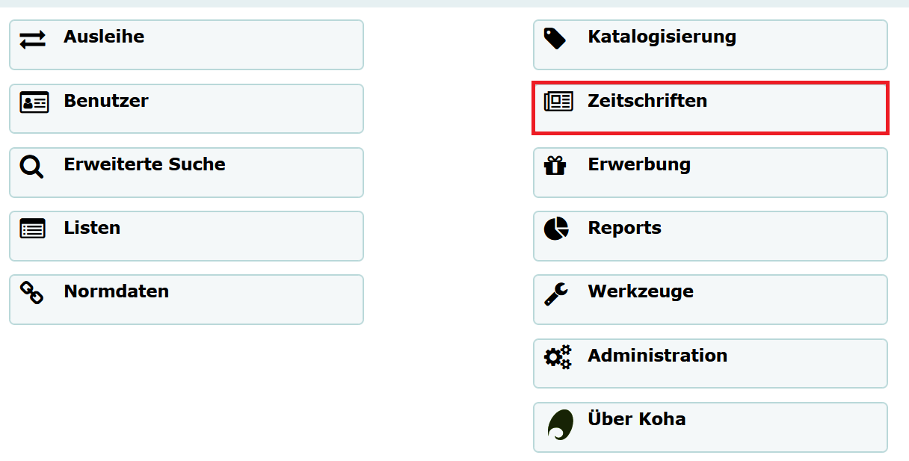
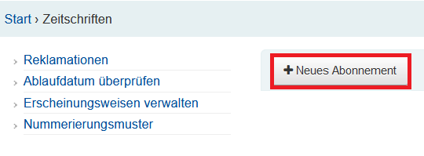
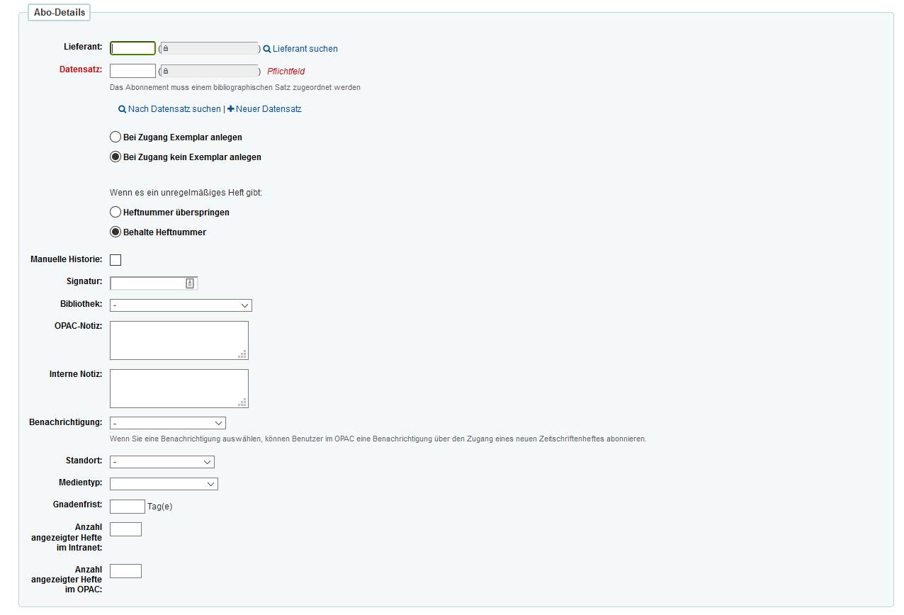
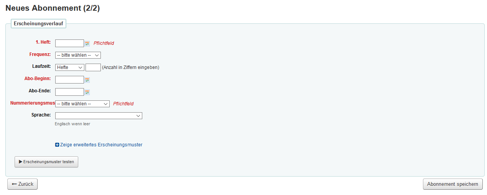
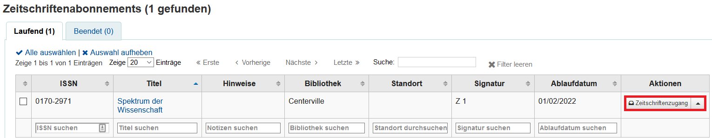
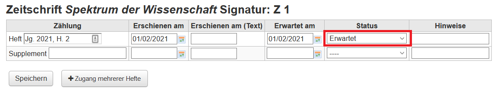

# Erwerbung - Zeitschriften
## Neues Abonnement anlegen
Für die Verwaltung von Zeitschriften gibt es auf der Startseite von Koha den gleichnamigen Unterpunkt:

 
Um ein neues Abonnement anzulegen, muss auf die Schaltfläche „Neues Abonnement“ geklickt werden.

 
Es öffnet sich eine Maske, in der die Abo-Details eingetragen werden müssen.

 
**Lieferant**: Hier muss die Lieferantennummer eingetragen werden. Mit der Schaltfläche „Lieferant suchen“ kann auch nach dem Namen gesucht werden. Der Lieferant muss zuvor angelegt worden sein.

**Datensatz**: Ein Abonnement muss immer mit einem bibliografischen Datensatz verknüpft sein. Es ist möglich, nach einem im Katalog vorhandenen Datensatz zu suchen, oder einen neuen Datensatz (ggf. über die Z39.50 Schnittstelle) anzulegen. Hierfür muss bei „Neuer Datensatz“ die Schaltfläche „Z39.50/STRU-Suche“ ausgewählt werden. Im Suchformular kann anschließend nach der gewünschten Zeitschrift gesucht werden und der neue Datensatz gespeichert werden. Gegebenenfalls ist es hierbei leichter, die Zeitschrift erst in einem Verbundkatalog (z. B. im K10plus-OPAC) zu recherchieren und anschließend den Titel mit der K10plusPPN im Feld Kontrollnr. zu suchen.

**Zeitschriftenzugang**: Bei Zugang kein Exemplar anlegen anhaken.

**Unregelmäßiges Heft**: Wenn die Nummerierung fortlaufend ist, sollte "Behalte Heftnummer" ausgewählt werden.

**Manuelle Historie**: Durch Anhaken der "Manuellen Historie" können Sie auch Hefte eintragen, die außerhalb des normalen Erscheinungsverlaufs liegen.

**Signatur**: Es muss eine eindeutige Signatur für die Zeitschrift definiert werden (z. B. Z 1). Diese gilt für die Zeitschrift als Gesamtheit, nicht für einzelne Hefte.

**Bibliothek**: Das Abonnement muss einer Bibliothek zugeordnet werden.

**OPAC-Notiz/Interne Notiz**: Im OPAC sichtbare oder interne Hinweise zur Zeitschrift

**Benachrichtigung**: Ist hier eine Benachrichtigung ausgewählt, können Benutzer im OPAC eine Benachrichtigung nach Eintreffen eines neuen Heftes abonnieren.

**Standort**: Der Standort entspricht den definierten Aufstellungsorten für Medien.

**Medientyp**: Hier bietet sich der Typ „Zeitschriften“ an.

**Gnadenfrist**: Nach diesem Zeitraum wird der Status eines erwarteten Heftes auf „verspätet“ gesetzt.

**Anzahl angezeigter Hefte im Intranet/OPAC**: Die Anzahl der zuletzt eingegangenen Hefte, die angezeigt werden sollen. Standardeinstellung ist 3 Hefte.

 
**1. Heft**: Erscheinungsdatum des ersteh erwarteten Heftes.

**Frequenz**: Der Erscheinungsrhythmus der Zeitschrift. 

**Laufzeit**: Das Abonnement kann nach Heften, Wochen oder Monaten gezählt werden.

**Abo-Beginn / Abo-Ende**: „Abo-Ende“ muss nur bei bereits abgeschlossenen Abonnements eingetragen werden.

**Nummerierungsmuster**: Es muss ausgewählt werden, wie die Zeitschrift nummeriert ist. Dies ist von Zeitschrift zu Zeitschrift verschieden. Sollte das Abo nicht mit Heft 1 beginnen (z. B. es wird im März ein neues Abo angelegt, Heft 3 ist das erste Heft, welches in der Bibliothek vorhanden sein wird), wird die Zeile “Innerer Zähler” mit der Anzahl bereits erschienener Hefte ausgefüllt. Mit „Erscheinungsmuster testen“ kann die eingetragene Erscheinungsweise getestet und ggfs. angepasst werden.
Durch „Abonnement speichern“ wird das Abonnement angelegt.
 
## Zeitschriftenzugang
Wenn neue Zeitschriften mit der Post geliefert werden, können diese nun in Koha eingetragen werden. So kann verfolgt werden, welche Zeitschriften in der Bibliothek vorhanden sind und ggfs. bemerkt werden, wenn Zeitschriften nicht geliefert wurden.

Bestehende Abonnements können im Zeitschriftenmodul mit der ISSN oder dem Titel gesucht werden. Wird die Suchmaske leer abgeschickt, erhält man eine Liste aller Abonnements.

 
Durch einen Klick auf die Schaltfläche „Zeitschriftenzugang“ können neu eingetroffene Zeitschriften im System erfasst werden.

 
Es wird automatisch eine Zählung, ein Erscheinungs- und ein Erwartungsdatum eingetragen. Der Status kann nun von „erwartet“ zu „eingetroffen“ geändert werden. Auch weitere Status wie „verspätet“, „vermisst“ oder „reklamiert“ sind bei Bedarf vorhanden. Die darauffolgenden Hefte werden von Koha automatisch nach der vorgegebenen Nummerierung generiert.

## Weitere Informationsquellen
* <a href="https://koha-wiki.thulb.uni-jena.de/zeitschriftenverwaltung/">Koha-Wiki der ThULB Jena: Zeitschriftenverwaltung</a>
* <a href="https://koha-community.org/manual/18.11/en/html/serials.html">Koha Manual – Serials (derzeit nur auf Englisch verfügbar)</a>
* <a href="https://wiki.bsz-bw.de/pages/viewpage.action?pageId=17565617&preview=/17565617/19827231/18-11_Workflows_Erwerbung.pdf">Bibliotheksservice-Zentrum Baden-Württemberg: Koha Handbücher / Workflows Erwerbung</a>
 
