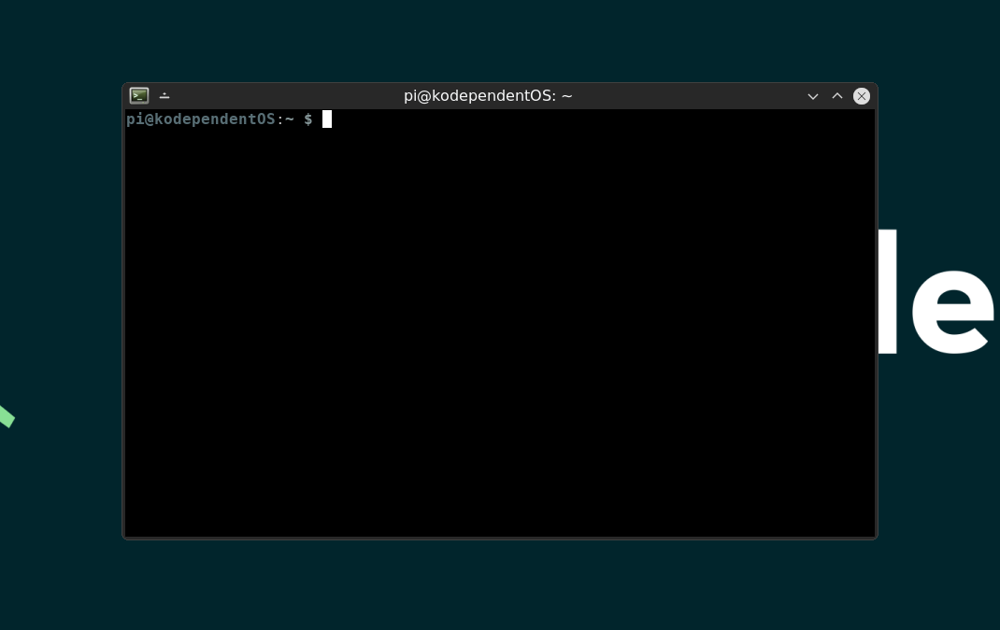
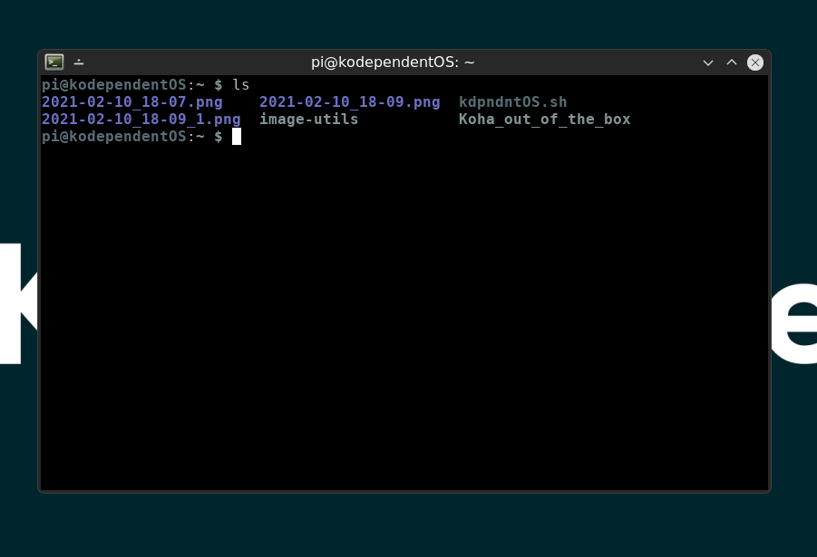
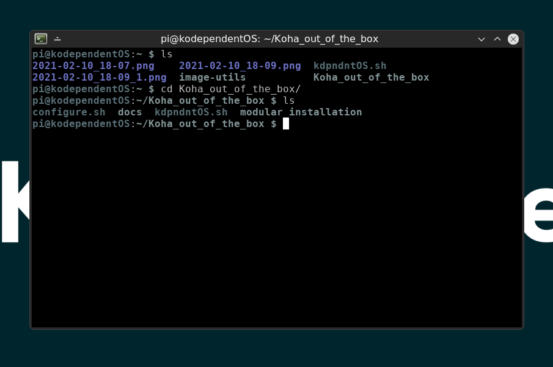
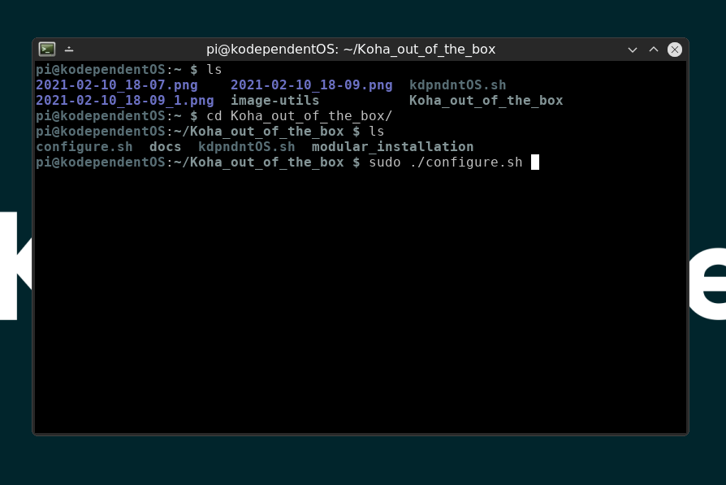
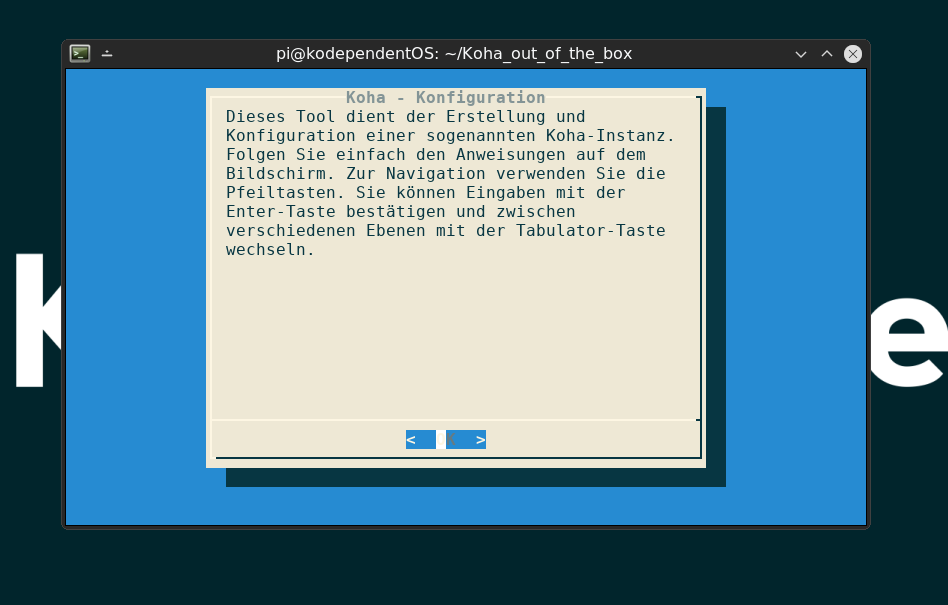
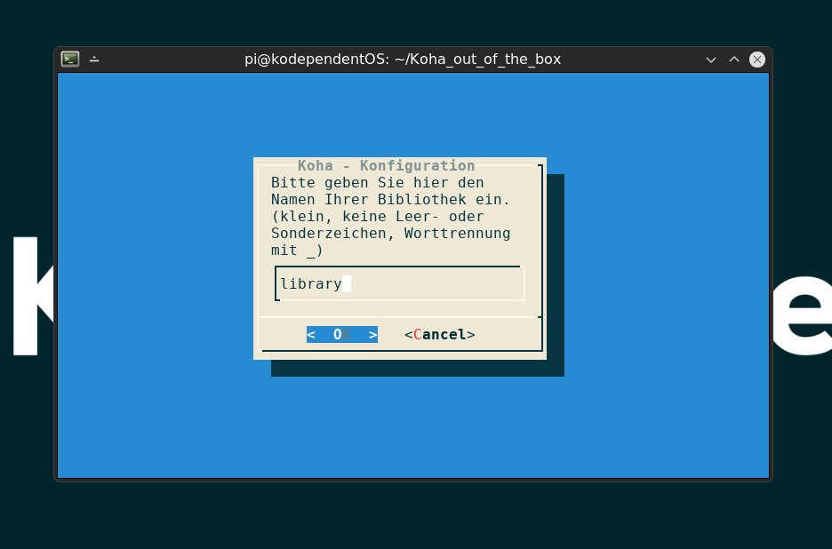
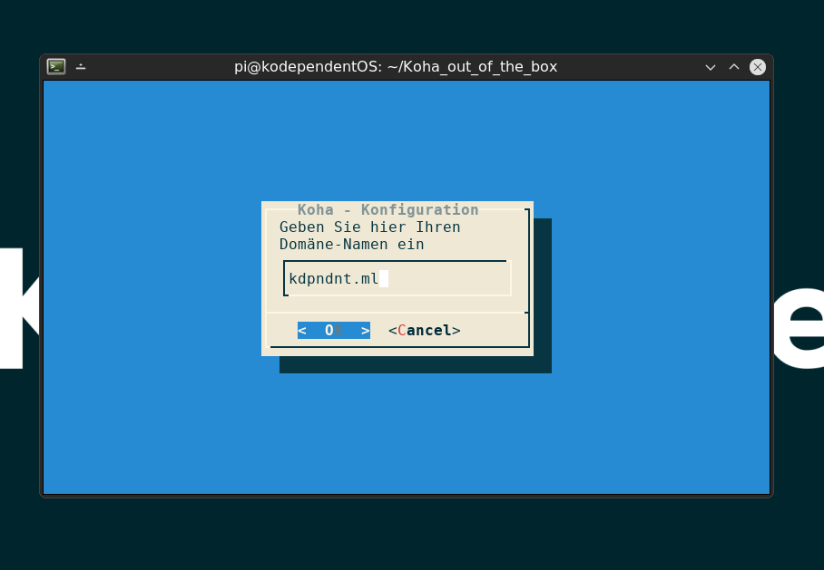
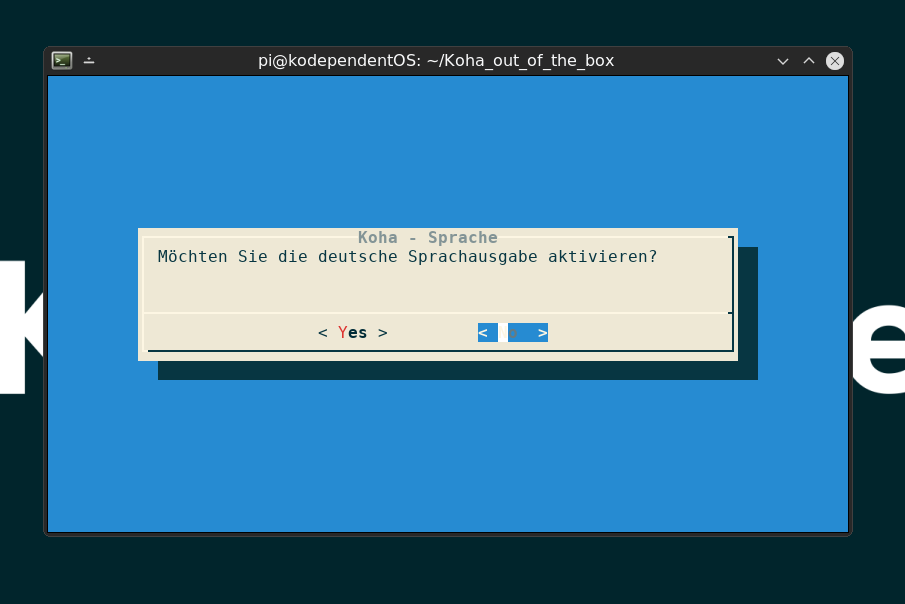

# Wie schaffe ich mir eine Koha-Instanz?

Im Folgenden erläutern wir Ihnen, wie Sie das Installationstool nutzen, um eine Instanz zu initialisieren.

## Booten 

Nachdem Sie entweder einen USB-Stick oder eine SD-Karte mit KodependentOS geflasht haben, booten Sie nun das entsprechende Medium.

### x86_64

Wenn Sie einen Desktop-PC oder einen Server verwenden, müssen Sie sich zunächst ein Linux-Image herunterladen.

* [Debian 10 'buster'](https://www.debian.org/distrib/) (empfohlen)
* [Debian 11 'bullseye'](https://www.debian.org/releases/bullseye/) wurde noch nicht getestet, funktioniert aber vermutlich auch.

#### Besonderheiten bei x86_64

Sobald Sie die Installation des Debian-Basissystems abgeschlossen haben, müssen Sie zunächst das Skript `kdpndntOS.sh`
ausführen. Da Sie kein vorbereitetes Image verwenden, benötigen Sie zunächst das Tool `git`. Hierzu müssen Sie zunächst die
Paketquellen updaten und `git` anschließend installieren.

```
apt update
apt install git
```

Anschließend klonen Sie das Projekt-Repository von der Plattform __GitHub__.

```
git clone https://github.com/pders01/Koha_out_of_the_box.git
```

Nun wechseln wir in das Projekt-Verzeichnis und führen das zuvor genannte Skript aus.

```
cd Koha_out_of_the_box/
sudo ./kdpndntOS.sh         # Führen Sie dieses Skript mit administrativen Rechten aus!
```

Nun können Sie sich an der Anleitung ab dem Punkt __Ausführen des Installationstools__ orientieren. \
Den Punkt __Öffnen eines Terminals in iceWM__ können Sie überspringen. 


### Raspberry Pi

Beim Raspberry Pi müssen Sie lediglich die SD-Karte in die dafür vorgesehene Öffnung schieben.\
Achten Sie hierbei darauf, dass die Kontakte der Karte nach oben zeigen.\
Nun können Sie das USB-C-Kabel in den dafür vorgesehenen Port schieben, und der Pi startet.\
Wenn Sie einen Monitor, ein HDMI/Micro-HDMI-Kabel und eine Tastatur zur Hand haben, können Sie\
den Setup-Prozess direkt auf dem Gerät vornehmen. Andernfalls bietet sich der Zugriff über die\
SSH-Schnittstelle an.

#### Verbindung via SSH

Falls Sie keine Möglichkeit haben Monitor und Eingabegeräte an den Raspberry Pi anzuschließen\
können Sie über eine Netzwerkschnittstelle mithilfe eines anderen Computers auf das System zugreifen.

##### Windows 10

Nutzen Sie die Tastenkombination `Win + x` um das erweiterte Startmenü aufzurufen und öffnen Sie eine Powershell.
Nun können Sie die IP-Adresse des Raspberry Pi bspw. über das Web-Interface Ihres Routers ermitteln.
Sollten Sie auf darauf keinen Zugriff haben, können Sie alternativ auch den [Advanced Ip Scanner](https://www.advanced-ip-scanner.com/?utm_expid=62919999-20._cHMXBX2SFul7hotDoAX2A.0&utm_referrer=https%3A%2F%2Fwww.bing.com%2F) der\
Firma famatech verwenden. Beachten Sie, dass es sich hierbei nicht um Open-Source-Software handelt.

##### MacOS 

Im Terminal können Sie folgenden Befehl nutzen, um die IP-Adresse des Raspberry Pi zu ermitteln.

```
arp -a
```

##### SSH nutzen

Anschließend können Sie mit dem folgenden Befehl eine Verbindung zum Raspberry Pi herstellen. 

```
ssh pi@IHRE_ERMITTELTE_IP # bspw. 192.168.123.1
```

Sie werden nun aufgefordert, das Fingerprinting zu erlauben, um Ihr Endgerät eindeutig zu identifizieren.\
Dieser Aufforderung können Sie mit der Eingabe `yes` nachkommen. Sie befinden sich nun in einer sogenannten\
Shell-Session, in der Sie den kompletten Setup-Prozess durchführen können. Beachten Sie jedoch, dass Sie\
innerhalb der Shell-Session keinen grafischen Desktop öffnen können, Stichwort: `startx`. 

## Was nun?

Nachdem Sie Ihr Gerät erfolgreich gebootet haben, finden Sie sich in sogenannten Shell wieder.\
Diese fordert Sie nun zur Eingabe des Nutzernamens und des zugehörigen Passworts auf.
Sie bestätigen alle Kommandos nach der Eingabe mit der __Enter-Taste__.  

```
Nutzername:     pi
Passwort:       raspberry
```

Aus Sicherheitsgründen sollten Sie Ihr Passwort direkt nach dem Login ändern.  

Nutzen Sie den folgenden Befehl:

```
passwd pi
```

Geben Sie nun das bisherige Passwort `raspberry` ein, und ersetzen Sie es durch ein Neues.

## Ausführen des Installationstools

Es gibt nun zwei Möglichkeiten, wie Sie weiter vorgehen können.\
Wenn Sie sich in der Shell wohlfühlen, können Sie das Starten des grafischen Desktops überspringen.  

Andernfalls geben Sie nun einfach folgenden Befehl ein:

```
startx
```

Dieser Befehl startet den X-Server des Linux-Systems und präsentiert Ihnen den iceWM-Desktop.

### Öffnen eines Terminals in iceWM

Um ein Terminal zu öffnen, dass Sie für das Aufsetzen einer Koha-Instanz benötigen, klicken Sie auf das __Menu__ unten links.\
Unter __Utility__ finden Sie den Terminal-Emulator __Sakura__. Klicken Sie diesen einfach an, woraufhin sich ein Terminal öffnen wird.



### Navigation innerhalb des Terminals

Sie müssen nun innerhalb des Terminals in das Verzeichnis, bzw. den Ordner wechseln, in dem sich das Installationtool befindet.\
Sie befinden sich standardmäßig im __Home-Verzeichnis__ des eingeloggten Benutzers, in diesem Fall __pi__.  

Um den Inhalt des aktuellen Verzeichnisses anzuzeigen, nutzen Sie den Befehl:

```
ls      # kurz für 'list'
```



Nun müssen wir in das Verzeichnis "__Koha_out_of_the_box__" wechseln.  

Hierfür nutzen wir den Befehl:

```
cd                          # kurz für 'change directory'
cd Koha_out_of_the_box/     # Hier wechseln wir in das genannte Verzeichnis
```




Sollten Sie sich verirrt haben, können Sie mit dem Befehl `cd ~` immer in das __Home-Verzeichnis__ zurückkehren.

### Wie führe ich das Installationstool in der Shell aus?

Da Sie nun im richtigen Verzeichnis angekommen sind, können Sie nun das Installationstool ausführen.\
Hierzu benötigen wir __administrative Rechte__. Diese erlangen wir mit dem Befehl `sudo`.\
Unter Umständen ist es nötig, dass Sie hierfür noch einmal Ihr Passwort eingeben. 

Für das Ausführen des Installationstools nutzen Sie den Befehl: 

```
sudo ./configure.sh         # durch './' führen wir ein Skript aus  
```

Alternativ könnten Sie auch die folgende Schreibweisen nutzen:

```
sudo sh configure.sh        # durch den Befehl 'sh', geben wir die Anweisung den entsprechenden Interpreter zur Ausführung des Skripts zu nutzen
sudo bash configure.sh      # analog zu sh
```



### Was muss ich im Installationstool angeben?

Es öffnen sich nun nacheinander mehrere Fenster im Terminal, in die Sie etwas eingeben können.\
Beachten Sie die Hinweise zur Navigation innerhalb des Tools. 



Nun müssen Sie Ihrer Koha-Instanz einen Namen geben.\
Achten Sie bitte darauf, dass sie keine Leer- oder Sonderzeichen verwenden und den ganzen Namen klein schreiben.\
Verwenden Sie statt dem Leerzeichen den Unterstrich: `_`.



Als Nächstes müssen Sie Ihre Domain angeben. Informationen hierzu finden Sie unter [Wie verknüpfe ich Koha mit einer Domain?](https://pders01.github.io/Koha_out_of_the_box/#/registrar)\
Geben Sie nur den Namen der Domain an, also bspw. `domain.com`.



Nun folgen noch die Aktivierung der deutschen Sprachausgabe, wie auch die Aktivierung des Mailservers.



Sofern alles funktioniert hat, und Sie die vorherigen Schritte im [Guide](https://pders01.github.io/Koha_out_of_the_box/#/registrar) bereits abgeschlossen haben\
sollten Sie nun in der Lage sein die administrative Oberfläche unter `IHRNAME-intra.IHREDOMAIN.com` erreichen zu können.  

* __IHRNAME__ entspricht hierbei dem Namen, den Sie im vorherigen Schritt für Ihre Bibliothek angegeben haben.
* __IHREDOMAIN__ entspricht der Domain, die Sie im vorherigen Schritt angegeben haben. 

Wenn Sie die Oberfläche des Intranets aufrufen, sehen Sie eine Eingabemaske.
Die standardmäßigen Anmeldedaten sind:


* Nutzername:	koha_IHRNAME
* Passwort:	Inhalt der Datei kpw.txt	# Sie können diese Datei mit cat ~/Koha_out_of_the_box/kpw.txt` oder einem grafischen Texteditor einsehen.

