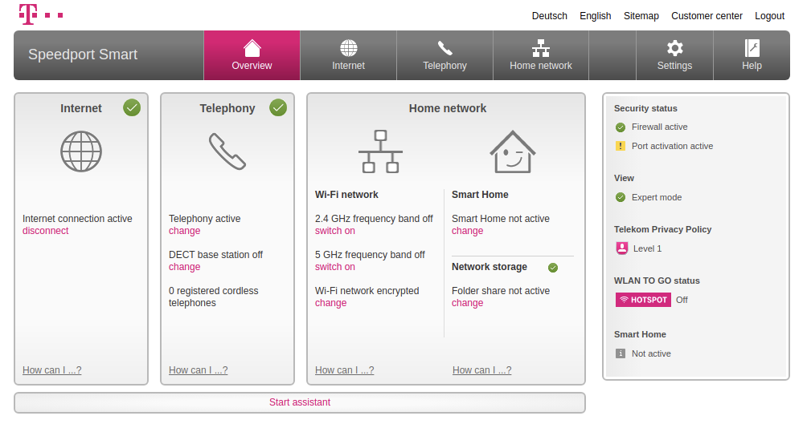
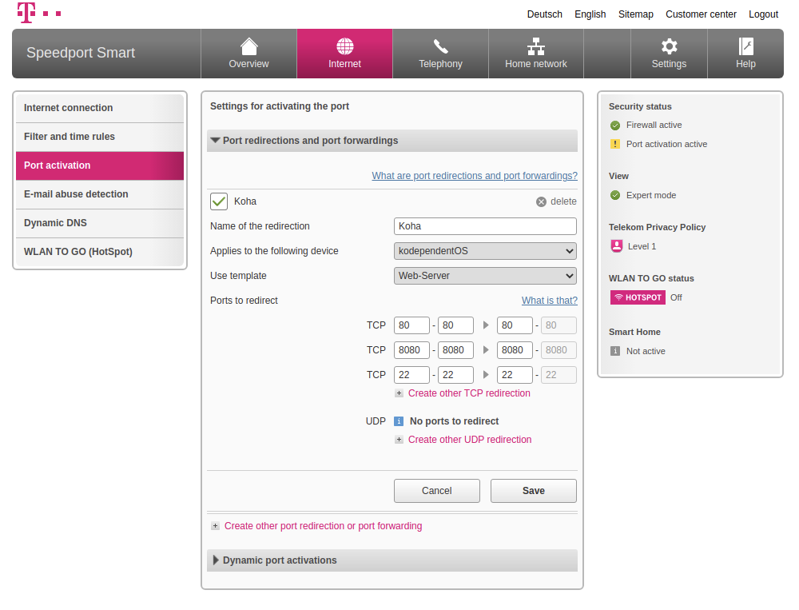

# Wie konfiguriere ich meinen Router oder mein Netzwerk?

In diesem Beispiel erläutern wir Ihnen, wie Sie Ihren Router konfigurieren müssen, wenn Sie keinen internen Ansprechpartner haben, oder das Projekt privat nutzen.  

Für den sehr wahrscheinlichen Fall, dass Ihr Netzwerk von einer IT-Abteilung verwaltet wird finden Sie am Schluss die notwendigen Informationen, die Sie in diesem Fall weitergeben müssen.

## Portweiterleitung

Im privaten Umfeld oder in Betrieben mit einem Business-DSL-Anschluss können Sie über Ihren Webbrowser eine Konfigurationsoberfläche aufrufen, auf der Sie die [Portweiterleitung](https://de.wikipedia.org/w/index.php?title=Portweiterleitung&oldid=198857220) aktivieren können. 

Hierdurch können Sie [Requests](https://de.wikipedia.org/w/index.php?title=Client-Server-Modell&oldid=206561421), die auf Ihrem Router eingehen an den entsprechenden Webserver weiterleiten, der diese dann entsprechend beantwortet.  

### Beispiel Telekom 

Ich zeige Ihnen nun am Beispiel eines Telekom-Anschlusses, wie dies in der Praxis aussehen kann. Hierzu rufe ich die IP-Adresse `192.168.2.1` der Konfigurationsoberflächen in meinem Webbrowser auf.\
Bedenken Sie, dass diese IP-Adresse je nach Anbieter variieren kann.  

  


Unter dem __Internet__-Reiter der Oberflächen können wir nun auf die Portweiterleitung zugreifen. Wie Sie sehen, ist hier schon eine Regel für die Portweiterleitung definiert.

  

Falls Sie auf diese Einstellungen noch nicht zugreifen können, müssen Sie unter Umständen in den allgemeinen Einstellungen Änderungen zu Ihren Berechtigungen vornehmen. Ich musste bspw. im Interface die Sicherheitseinstellung von __Basic__ auf __Expert__ umändern, um Regeln für die Portweiterleitung definieren zu können.  

In der Ansicht ist erkennbar, dass sich die Regel auf das Gerät `kodependentOS` bezieht (Unter "Applies to the following device"). [KodependentOS](https://github.com/pders01/kodependentOS) gibt diese Bezeichnung standardmäßig im Netzwerk an, was die Identifikation erleichtert. Sollten Sie im Menü keinen namentlichen Eintrag finden, können Sie das Gerät auch anhand der IP-Adresse identifizieren.  

### Port 80

Die Telekom bietet hier sogenannte Templates an, die gängige Ports in der Regel eintragen. Wichtig ist lediglich, dass Sie hier den `Port 80` in der Regel angeben. Sehr hilfreich ist hierbei auch, den `Port 22` für __SSH-Verbindungen__ anzugeben, sofern Sie diese nutzen wollen. Wenn Sie die Portweiterleitung für den `Port 80` eingetragen haben, speichern Sie die Konfiguration. 

## Informationen für Ihre IT-Abteilung

Wichtig sind hierbei:

### Öffentliche IP-Adresse des Servers

Sie können einfach dieses Skript ausführen, und sehen anschließend die IP-Adresse Ihres Servers im Terminal.

```
sh ~/Koha_out_of_the_box/modular_installation/public_ip.sh
```

### Ports

* `Port 80` für den OPAC und die interne Nutzeroberfläche.
* `Port 22` für die SSH-Schnittstelle (optional).

### Koha-Instanz

Wenn Sie eine Koha-Instanz erstellen, werden Sie nach einem Namen für diese Instanz gefragt.\
Diesen sollten Sie sich notieren, da hieraus die Subdomains im A Record generiert werden.\

Sollten Sie Ihre Instanz bspw. __library__ genannt haben, würden die Domains so aussehen: 

```
library.domain.com          # library für den OPAC
library-intra.domain.com    # library-intra für die Administrationsoberfläche
```

Hier ist __.domain.com__ einfach nur ein Platzhalter für die Domain Ihrer Einrichtung, o. Ä..
